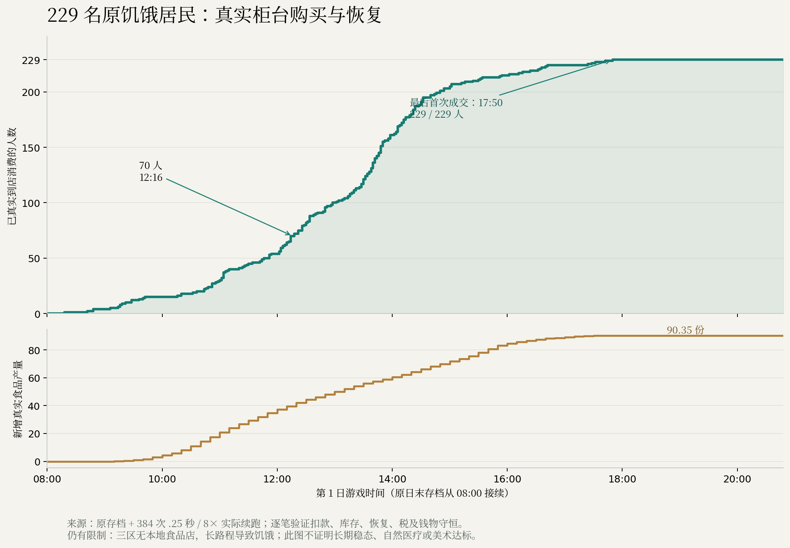

# 云山 ROOT16：真实购粮恢复、有限医疗和纯参数食品诊断

2026-10-05，从工作分支 `takeover-city-life` 的 a1888cd 接续。保留原实现 42a50aa、已有美术和全部旧失败记录。本阶段完成原名单 229 人真实购粮、一个患者的有限供料治疗链，并安装可离线读取地图与存档参数的食品访问诊断。完整 38 领域目标仍未完成；main 未修改，无新部署。

## 实现和证据作用域

原业务图为 `4f1c39d4769b4172f9aed8477b666c480cb1b4be2d7a244d8144d7d1408c9927`：322 输入、80 src、119 测试模块。食品与医疗实际运行都绑定此图，原 117 测试文件未改。新增加三个独立只读文件，形成 `0c7aea22807f69ac83450ecd201d5ee6e933dff816e937cf18b0728e97d7a0da`：325 输入、81 src、120 测试模块。所有原 322 文件逐字相同。

- `src/simulation/food-access-observations.ts`：从给定 World/存档观察食品分布、饥饿居民、路线与引用完整性。
- `scripts/food-access-audit.ts`：读取现有参数，检查源文件、World 和存档保持不变；不创建城市、不构造 Simulation、不运行 step。
- `tests/food-access-observations.test.ts`：7 个纯诊断测试，包括缺建筑引用、地区不一致及特殊计数键。

诊断能用于其他满足数据契约的城市，不等于任意真实地图已经可直接运行。它明确报告未观察的实体可达性，不把图连通或可购买当作实际到店。既有 renderer、移动器、选店评分、生产规则和旧断言本轮未改。安装及构建原件见 [INSTALL-RECEIPT](evidence/integration/INSTALL-RECEIPT.json)、[325 输入](evidence/integration/INPUTS-325.json)、[build 回执](evidence/integration/build01/receipt.json)。

## 原 229 人食品恢复

从 ROOT15 默认 current-v6 城市真实一天终档接续：612 建筑、616 NPC、674 道路节点。原文件 `db40c8410ed5cd45f308fb12c12a4ef6678c58add40e3122e595a6bdd99efe16`，tick720，第1日08:00。固定名单为 229 个饥饿且无携粮居民：193 步行、36 乘车，均选择吃饭，没有 physicalWaiting。

先执行原 .25 秒/speed8 的 128 步；诊断观察 70 名原居民的 119 笔真实柜台交易。随后从其真实终档和原收据声明新的 256 步有界续演，追加 394 笔目标交易。两段合计 **229 名原居民、513 笔本人柜台收据**，逐笔核对价格、钱包扣款、库存、饥饿恢复、携粮、营业款、成本、税与请求消耗。

最后一人的首次柜台交易发生于 tick1015，即原日末后295步/590游戏分钟，第1日17:50；观察继续至 tick1104/20:48，共384步。616人存活，终态饥饿且无携粮0。真实食品生产合计90.35028973669502；现金守恒最大残差1.6298145055770874e-9，食品守恒最大残差4.263256414560601e-12。原229目标群体内观测到的实体移动拒绝0；不据此保证全城未来无移动阻碍。

两个实跑分别127.878877秒/cap600、163.708973秒/cap600，源322前后相同，owned active[]。这证明固定原名单在有界正常规则续演中真实消费恢复，不能推广为长期供需、财政稳态或每个未来时刻都不饿。

实际原因仍需后续处理：academy/government/starport 三个地区没有本地食品店，包含原名单163人；193步行者原余路中位1418.19m。154人的路线条件估计比饥饿降至0更慢。静态图连通、买得起都不能消除赶路时间。原994次选择未见明显 A→B→A 往返循环，不能据此改评分掩盖空间缺店。31农场原库存高于目标，默认城原因也不能混同另一医疗 fixture 的断路和断粮工人。

原件见 [食品报告](evidence/food/FOOD-DELIVERY-REPORT.md)、[因果报告](evidence/food/cause/ROOT16-FOOD-CAUSE-REPORT.md)、[128 步回执](evidence/food/baseline-observe01/receipt.json)、[全部229回执](evidence/food/all229-continuation01/receipt.json)。完整逐笔 JSONL、所有终档和原 World 在交付证据 ZIP 内。

此图按实际收据绘制，是验证图，不是新游戏画面或美术验收。[229 人首次交易 CSV](figures/229-residents-first-counter-receipt.csv)、[作图来源](figures/FIGURE-PROVENANCE.json)。

## 一个患者的有限医疗闭环

继承旧医疗 actual03 的真实 FAIL 终档：`74b488c8e3c39d762b90613f50c2cf97aa34bd89c54ef8027ebdef2f4cdeccce`。这是47建筑/47节点/36边/11道路组件/616NPC的自定义 civic fixture，World SHA `abce713388422385a3754fc8d760745526d95fdb4268546057e5a748d8df6ea1`，不是612建筑默认城。旧240帧0/6 FAIL保持原样。

声明 NEW512 正常 main 帧、每帧≤1秒、原 speed16/cap900，只验一个玩家患者。实际292帧/984内部tick/3936游戏分钟，236.596711秒完成。使用原 PlayerController 的 W/mouse/F 受控移动与合法命令，真实行走1074.740672m。属于 headless 受控身体宿主验证，不认证浏览器自然旅程、正常速性能或全程连续楼梯。

实际购18份食品，实扣276.0304831081276；13次实体≤2m赠送分别供给农场主4、工坊主4、医生5，每次保留支撑、ACL、遮挡和冷却检查。执行3次诊所休息，各扣15。没有注入 NPC 位置、钱粮、需求、身份或时间，没有替换工班审批。

实际新产材料25.895293717549915，经原采购和维护消费；医疗原 cap40 实付40、采购4.421864795686247、治疗消耗1、余3.421864795686247。医生当前day9工班由真实前一天合规审批，患者与医生在 clock13808–13828 五个工资窗口累计20分钟。产生一个唯一公共医疗来源和一个污染废物批次 `waste-1`，完成实际健康增益及医生后续实薪。现金/食品/材料最大守恒残差分别4.190951585769653e-9、3.183231456205249e-12、4.440892098500626e-16。

**完成1名玩家患者，原6目标其余5名尚未完成。** 不能称默认城自主医疗、六人容量、完整污染回收或卫生病毒系统通过。当前剩余原因已单列：医生及材料工坊仍需实际补给；新 V2 cap14 请求无批准，需要两名当前实薪且在本地的审批人；已有医疗材料不足再服务5人；下一次患者身体到达尚未观察。不能伪造病人、审批、食物或延长旧失败边界填满人数。

原件见 [医疗报告](evidence/medical/REPORT.md)、[实际运行回执](evidence/medical/actual01/receipt.json)、[剩余容量静态观察](evidence/medical/REMAINING-CAPACITY-STATIC.json)。医疗全套原件、预运行修订、旧 FAIL、完整输出和完整闭包在证据 ZIP 内。

## 保存、测试和未完成边界

| 验证 | 实际结果 | 作用域 |
| --- | --- | --- |
| 食品128+256步 | PASS，原229人全部真实购粮 | 原322默认城业务图 |
| 食品whole/partition未来24 | PASS，立即及每步逐字相同 | 无World可选参数的787 generic parts |
| 食品地理分块物理写读 | PASS，124 parts组回同一食品终档 | 0Sim/0step；不另称新地理reader未来24或流式卸载 |
| 医疗一个患者及future24 | PASS，whole/World-assisted44 parts每步相同；终态/未来各44文件物理读回 | 原322自定义医疗fixture |
| 新诊断纯测试 | 7 PASS | 最新325图，candidate02 |
| 新诊断CLI | 两个真实食品存档PASS，0Sim/0step、源参数不变 | 原229终档与恢复终档 |
| 最终构建 | PASS，17.240155秒/cap180，325源稳定 | strict tsc+Vite |
| 最新325完整npm/UI/browser/Mac | NOT_RUN | 旧ROOT15 UI35窄PASS保留其原322作用域 |

保留原全套 OOM 和后续3600秒 TIMEOUT_PARTIAL（280 PASS、79 cancelled），不以本次7测试替代全套结论。旧 tenant 第三轮未观察/候选未安装、ART FAIL、Mac未运行等不变。完整剩余项见 [38领域需求矩阵](REQUIREMENTS-MATRIX.md)：长期财政食供、完整家庭生命周期/继承、文化信息日常、能源医疗科技政治教育深度、动态买租店铺、整栋拆迁安置和新道路、火灾地震、环卫和虚构病毒、真统计区/流式模拟/分块保存以及参考图美术。

## 可直接接续的下一步

1. 从真实食品终档 `edf73ed2aa923b16248f3981092ea78dfe6375e5be1a4d4e3c6914ca84285754` 和原322业务图接续；验证三区缺食品服务的有限经营供料、居民自愿产权/租赁和长期财政食供，不加钱粮或削弱断言。
2. 从医疗真实终档 `129bb28c031dbb957962e0f7e32b010420061b7124f3e141173b23337952e1e2`（24步后 `92d706cda7ef5ef42e50dee98a30dd8574e6b991fea505fd31bed6838688edda`）接续；先完成医生/工坊真实补给、当前合法审批及有限材料，再记录下一真实患者身体到诊所与治疗。
3. 新增纯诊断可先用于参数驱动的城市审计；缺建筑、缺店、长路、坏引用明确报告。通用电网/道路/设施诊断、完整 CityPatch、任意真实地图产品仍待实现。

源码与完整原件交付包见 `delivery/`；重放边界见 [REPRODUCE](REPRODUCE.md)。Library 和 Git 的最终保存结果按单独交付回执列出，ZIP为封存时原件，不倒改字节填入后续发布结论。
