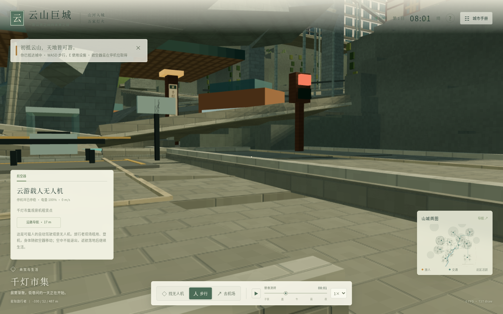
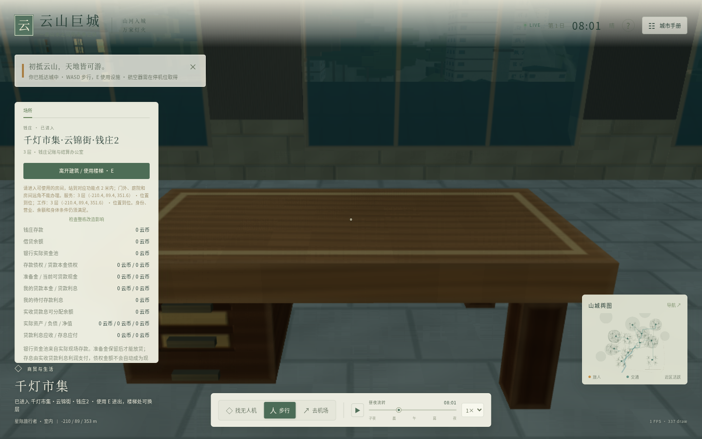
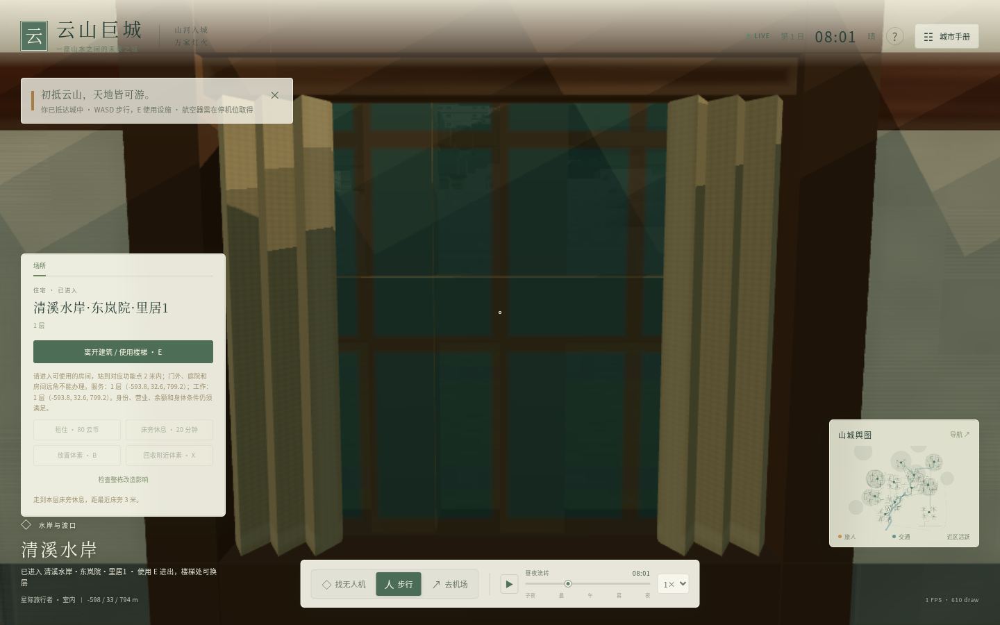
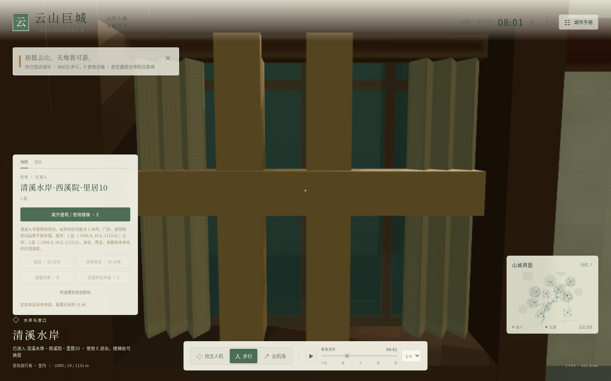

# 云山 ROOT18 阶段结果

已沿最新实际 main 70447c1 的现有成果继续，整合真实跨区粮食配送、参数世界世代宿主和办公桌／住宅窗帘。没有重建脚手架。第一人称城市生活仍是核心，完整38领域目标持续中。

## 这次修复

旧64步证明五辆农场粮车把140单位都卸回没有market的农场区，供应商收款0，而47个供货设施与109个market实际门节点在同一road连通分量。根因是送货／消费合同错配。新独立road-food-delivery-v1让货车按真实开放道路送到低库存、能付款的市场门，并保持原信号、容量、等待、能源、所有权FIFO、真实付款与工资保护。没有虚增现金或库存。

真实256步窗口内交付56单位、四笔各14采购：支出224，供应商净收206.08，税17.92；现金最大守恒误差1.1641532182693481e-9、粮食误差0、616人存活。06:08窗终另56在途，未预认收入。日班产粮、工资循环、14日稳态尚未证明。

新游戏入口完成原材料调度升级后，再显式启用送货规则；旧存档导入整体恢复旧规则。四个原factory原文保留。旧规则80步每步／末档字节相同，但该原窗口整体在0新送货步之前因新driver预期键序FAIL；修正预期的另一个256步窗口PASS，不能合称一次336步PASS。所有原失败与原件保留。

## 实际验证

| 范围 | 结果与边界 |
|---|---|
| 最终 source362 相关回归 | 16模块104/104 PASS；原229测试/helper/fixture文件SHA保持；不是完整npm test和全38领域验收 |
| 严格类型检查／生产构建 | PASS；真实入口index-WUxLc_H8.js，SHA4df0c6f…6264b1 |
| 新世代宿主 | 完整受信参数World／原生存档／消费者暂存与同步发布；24次构造144普通步已独立验证；不是现城拆迁施工，GUI尚未换代接入 |
| 真实全城市存档 | 124个原生分块逐一落盘／读回／重组与原d5c9213档全字节同 |
| 整合存档续跑 | 原配送355全档control／整合362全档／整合362分块3实例，各24步，共72；每步3份全save字节同 |
| 家具353真实图对比 | 原351与353各4张，逐场全save/body/camera同，GL0；两住宅实际各付80租金、真实E入门，位置是披露视觉夹具 |
| 最终362实际产品GPU | 2张原生PNG，fresh双送货声明、旧真档导入恢复legacy、截图前后全save同、GL0、程序全部linked |
| 完整参考图美术／Mac硬件 | 完整美术FAIL；macOS NOT_RUN |

真实最终续跑261.023636秒/cap360，tick1408/clock3296/第2日06:56，FINAL.save.json SHA d3bc6859ba0849ccbc554782c5f4f6fe932acf706466771a60c098036130dfeb，616存活。World完整原件SHA2912839d…8512。所有原输入前后不动，无活动owned后代。当前只读cargo84与districtfreight1338为所有货物快照，不冒充新结款证据。

source362 manifest存key顺序compact图1ebd4ee6576b8ee29095598262daae518a31e5eec7672cdee913499434f16090；字符串lex排序为ccf9e2ce…21e1。按说明复算，不能混用。初次准备误标serializer的0浏览器前置失败也保留。

## 实际画面

381真办公桌位已接木面／抽屉／腿；221住宅×2=442窗位已接布帘／玻璃，床原构件、楼层和碰撞契约保持。沙发、显示器、茶几的原模型文件尚未成为购买、放置与使用闭环。

这些原图未编辑。两窗帘／桌的局部改善已验证，但街景、楼群层次、光照、出生桥下构图和整体资源仍与参考图差距很大。Linux软件GPU不提供Mac硬件FPS证据。两个版本4+4图及最终2图、首失败1图，共11张均在原件包内；最终office未租前次两住宅，不把不同业务全save当跨版本同场景。出生场景三源351/353/362的全save/body/camera相同。

## 完整系统仍需继续

[MATRIX-38.csv](MATRIX-38.csv)保留38个ID与11旧列418格，仅更新三列ROOT18进度；[进度说明](evidence/MATRIX-STATUS02.md)标明具体已实现、实际验证、剩余与下一验收。能源、医疗、教育、科技、政治、文化信息、家庭自然世代、卫生／垃圾／污水、虚构病毒都在完整范围。商店困境／倒闭后居民现场租购、合法采购和恢复雇员已有分段闭环，仍需日班自然经营持续验证。

另一城市可基于完整受信参数World和其完整合法存档由文字宿主运行／换代，并可供2D消费者暂存；还没有把当前城市居民／产权无损移植到任意新拓扑。居民意愿、社会身份与产权审批驱动的拆迁、安置、道路施工、有限钱料工时、火灾地震结构损害和救援重建仍未完整实现。实际统计区、远区个体恢复、流式加载、cold chunks及崩溃恢复也仍开放。

从d3bc真实末档／World291直接继续06:56之后的晨间通勤、7:30实际日班、材料／食品生产、工资／公共收支和在途合法交货；先冻结计划、source与输入SHA，保持原speed8和普通step(.25)，找真实原因再修复回归，不加虚钱或改需要／身份／时间。然后继续矩阵其余公共医疗正例、能源网格、教育文化科技政治日常、自然代际与环境／产权施工。完整目标未结束。

## 原件与交付

[原件索引](DELIVERABLES.json)列出七个可独立下载的完整ZIP及四张PNG的SHA。生产者源包保存完整源，验证包保存原driver／事前PLAN／原生全存档／原失败raw／实际回执及精确源包引用；各包CRC与payload SHA核验通过；source362包还保留实际dist。最终整合包包含全部124个原生分块与72调用／24帧原观察。所有包凭据形状扫描0命中；未使用过期Tripo凭据。

本报告是已完成运行的冻结快照。Library保存和工作分支提交／推送结果另记真实交付回执与[最新开发备忘录](../../../开发备忘录.md)，不预告成功。只按用户本轮授权推takeover-city-life，未新建PR、推main或发起远端merge／部署。

Library实际交付结果：本轮16项保存连接失败，0新的LibraryID，原Library备忘录version7未替换。不得把本目录原文件说成Library附件已送达。报告、七个完整公开原件包及四张原图将按用户授权推工作分支；实际提交／远端readback另存DELIVERY-RECEIPT.json。

实现及本目录原件已实际提交并推送：[90c5487](https://github.com/egysoloman/yunshan/commit/90c5487c0cd4e3536681b2534cf517c36f91edfe)。远端takeover-city-life读取为同SHA，main仍70447c1。工作树在交付回执追加前为空。[实际交付回执](DELIVERY-RECEIPT.json)保留当前实测与可直接接续末档；后续doc-only回执提交不改变source362或原件。Library失败，没有本轮附件ID。
