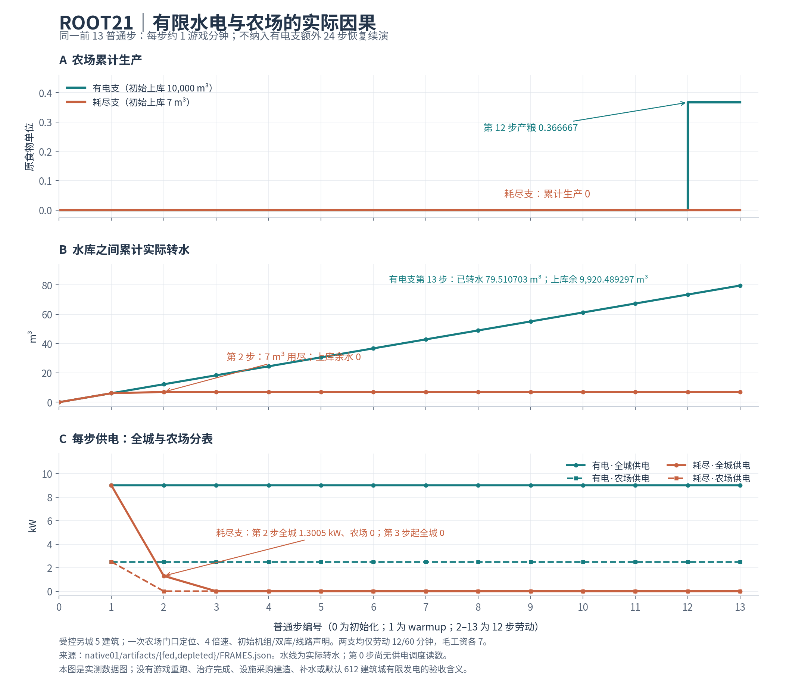

# ROOT21 进度报告：有限水电的真实因果已验证，完整城市生活继续开发

日期：2026-10-07。项目：`/workspace/yunshan`，工作分支 `takeover-city-life`，本轮接续基线 `d79b1e6882f1dd7036dcc64f533baeba406d735b`。本报告依据实际回执、原始帧和开发备忘录编写，已包含 `build-final` 与 `legacy-equivalence01` 的结束结果。

ROOT21 已把一座明确声明的另城接入有限双水库、单常水头水电机组和有容量约束的电网，并实际验证了“供电充足时农场产粮，水源耗尽后农场停止产粮”的因果。新构造的完整存档、原档副本和实际分块恢复，也已与原实例连续 24 步逐帧一致。默认 612 建筑城市尚未启用这套有限发电系统；设备采购、建造、维修、补水和长期运营仍未完成。

用户的核心目标仍是可以用第一人称居住、工作、消费、出行、学习和参与社会的城市生活。能源只是其中一个基础领域。本轮局部通过没有关闭医疗、科技、教育、政治、卫生、疾病、灾害、动态商业、家庭世代、建造路网、参考美术和性能等完整目标。

## 1. 本轮实际完成与验证边界

| 项目 | 实际结果 | 可以支持的结论 |
| --- | --- | --- |
| 原因修复前回归 | 4 个针对性回归全部 FAIL，原件保留 | 数值域、浅冻结声明/恢复子项、错误入口类型的问题真实存在 |
| `pure02` | 3 文件，56/56 PASS，0 FAIL/SKIP/cancel | 保留原 17 项 oracle，验证有限水电、分页边界、精度、深冻结和灯火规则 |
| `build02` | 完整 TypeScript + Vite 构建 PASS | 当时绑定的产品源码能够构建；原 bundle 大小警告仍在 |
| `build-final` | 最终完整 TypeScript + Vite 构建 PASS，输入392且稳定 | 本轮最终输入构建通过；构建没有提供硬件性能验收 |
| `native01` | 136 个普通 step，回执 PASS | 受控另城业务、局部故障、实际落盘和恢复一致性通过 |
| `legacy-rules01` | 9 文件，79/79 PASS，0 FAIL/SKIP/cancel | 原电网、劳动、当前工资来源、灯光、建筑改造、临床供电相关规则回归通过 |
| `legacy-equivalence01` | 主城生产档与旧 v1 档，各旧/新源码4步；共16普通步，两个case全部精确一致 | 已验证窗口内完整存档、所有事件和阶段顺序没有差异；没有新增主城钱粮因果审计结论 |
| 新 GPU/UI、macOS 实机、默认大城长期有限水电 | 本轮 NOT_RUN | 没有新增画面、硬件性能或长期经济稳态验收 |

首次 `tsc01` 的 3 个联合类型错误也保留在原始回执中；最终 3 个旧测试文件只做类型收窄，已有独立转译 JS 前后逐字等价记录。修复后的通过记录没有抹去这些失败事实。

原生 136 步由两支业务各 13 步、11 个局部案例共 14 步、原实例及三支新构造恢复各 24 步组成，即 `26 + 14 + 96 = 136`。恢复分支是受控另城存档的续演；主城生产档兼容对照属于单独工作。

主城生产档兼容对照实际时钟为 `3900→3908`，旧 v1 为 `480→481`；每个 case 都在旧、新源码各运行 4 个普通步，合计 16 步。两份比较结果均为 `PASS_EXACT_FULL_SAVES_EVENTS_PHASES`，`differentFiles=[]`、结构差异数为 0，每个 case 各有 10 次原生 reader 检查。这个短窗验证了既有行为没有改变；它没有单独提出新的主城 cash/food 因果审计或长期稳态结论。

## 2. 同一前 13 步的能源—生产数据

图只取两支的初始化、第 1 步 warmup 和随后 12 个劳动步，共各 14 个观测点。购买、签劳动合同产生的同 tick 帧不计成额外步；有电支随后额外 24 步的恢复续演未进入对比。第 0 步尚无供电调度结果，图中没有替它造一个 0 kW 读数。食物量沿用原系统单位，没有换算成公斤。

| 同一 tick13 业务检查点 | 有电支 `fed` | 耗尽支 `depleted` |
| --- | ---: | ---: |
| 初始上库水量 | 10,000 m³ | 7 m³ |
| 累计实际转水 | 79.51070336391435 m³ | 7 m³ |
| 上库剩余水量 | 9,920.489296636084 m³ | 0 m³ |
| 累计实际发电 | 1.95 kWh（浮点原值 1.9499999999999997） | 0.171675 kWh |
| 第 13 步全城供电 | 9 kW | 0 kW |
| 第 13 步农场供电 | 2.5 kW | 0 kW |
| 农场累计生产 | 0.3666666666666572 原食物单位 | 0 |
| 原系统累计食物消耗 | 2 | 2 |
| 玩家实际劳动 | 12 分钟 | 12 分钟 |
| 玩家原生 earned / paid 事件 | 12 / 12 | 12 / 12 |
| 玩家实际毛工资 | 7 | 7 |
| 已托管工资 / 仍托管余额 | 35 / 28 | 35 / 28 |
| 60 分钟工作合同 | `working`，完成 12/60 分钟 | `working`，完成 12/60 分钟 |

耗尽支第 1 步仍供应 9 kW；第 2 步上库用尽，该步全城只供应约 1.3005 kW，农场分表已为 0；第 3 步起全城供电为 0。有电支第 12 步发生实际产粮，累计约 0.366667。两支仍按真实出勤履行已托管工资，缺电没有凭空取消已经发生的工资义务。

两支都先通过原生购买命令买 30 份和 11 份食物，再通过原生工作命令开始现场合同。场景有明确受控前提：原四栋 compact `gridWorld` 建筑与道路，加一座声明的能源设施、三条分开的馈线、一个常水头机组和两个封闭有限水库；使用一次农场门口 `setFocus` 和 `speed4`。居民、钱包、需求、原商铺库存和资本等由未改动的 Simulation 构造过程初始化。该记录证明受控现场业务，没有完成自然步行旅程或 60 分钟工班；初始设施声明也没有完成钱、材料和劳动支持的设备采购建造。

## 3. 原账、故障与存档证据

各次普通步都核对原始钱、粮、水、电账。前 13 步业务窗口的最大绝对残差如下，均为原生审计通过范围内的浮点残差：

| 原账残差 | 有电支 | 耗尽支 |
| --- | ---: | ---: |
| 钱 | 5.820766091346741e-11 | 5.820766091346741e-11 |
| 粮 | 2.842170943040401e-14 | 0 |
| 水 | 1.9042545318370685e-12 | 0 |
| 电 | 2.220446049250313e-16 | 0 |

有电支额外 24 步继续逐步审账，包含前 13 步在内的最大钱残差为 `2.0372681319713593e-10`，水残差为 `4.888534022029489e-12`，电残差为 `3.552713678800501e-15`。这些后续数据用于恢复与审计结论，没有混入上面的同窗产量对比。

11 个局部案例覆盖出水口关闭、下库满、诊所孤岛/未接线、农场孤岛/馈线容量/节点容量、空需求，以及原生车辆供电和车辆孤岛/未接线。医疗证据限于无电时 `clinicalPowerAvailable` 为 false、`claimClinicalCareMinutes` 返回 0、完整存档不变；`MEDICAL-POWER-GUARDS.json` 明确 `completedTreatment=false`。本轮没有实际患者完整治疗，也没有伪造病情或医生劳动。

存档证据来自实际写盘和读回：4 个物理 part 全部读回后通过原生 assemble；缺失一个实际非空数组 part 被拒绝。每份唯一完整 UTF-8 存档使用 gzip 保存，核对编码文件及解码原文的 SHA/字节；88 份完整 gzip 原件共 4,825,004 B，另存原文终档 495,807 B，两者合计 5,320,811 B；gzip 解码唯一完整原档共 39,150,011 B。原实例与三个 fresh 构造恢复分支（whole/rawclone/parts）各续演 24 个普通步，每帧完整 save、全部原 bus 事件和固定十阶段顺序逐字相同。该证据尚未覆盖断电数据库崩溃恢复或任意新地图的拓扑迁移。

本轮还修复了有效双精度数量可能产生供电却不足以改变实际库容的问题，以及陌生浅冻结对象跳过孩子深冻结的问题。数值域守卫在接入前要求最小输配窗足以真实改变双库，既有物理 guard 和原 17 项 oracle 保留。这是已审查的特定 guard 路径；引擎中任意异常的全事务回滚仍没有完整证据。

## 4. 完整 38 域范围矩阵

本表保留全部目标领域，以本轮增量和主要后续工作说明边界。历史实现、失败及证据继承[开发备忘录](/workspace/yunshan/开发备忘录.md)。根代理制作的[ROOT21 完整 38 域矩阵](/workspace/yunshan/docs/validation/2026-10-07-city-life-root21/MATRIX-38.csv)在前轮内容后追加5列，[保存核验](/workspace/yunshan/docs/validation/2026-10-07-city-life-root21/MATRIX-PRESERVATION.json)确认旧836个单元格逐字保持。表中的“未增验”表示本轮没有为该领域新增完整验收，不改变此前局部成果，也不清除原 FAIL、SKIP 和 NOT_RUN。当前没有任何一行据本轮局部 PASS 获得“完整目标全部完成”状态。

| ID | 领域 | ROOT21 阶段边界与主要剩余 |
| --- | --- | --- |
| SYS-01 | 核心与表现 | PARTIAL；原固定十阶段、原事件与完整存档精确续演已验；出生完整第一人称日常、异步 GUI、完整 2D/文字产品仍欠 |
| MAP-01 | 地图适配 | PARTIAL；明确另城有限能源声明已运行；任意程序/GIS 地图、设施能力配方和动态拓扑迁移仍欠 |
| MAP-02 | 规划诊断 | PARTIAL；另城电网孤岛、未连接和容量案例已验；统一缺建筑/缺电/路网诊断与合法拆建迁移仍欠 |
| MAP-03 | 地图与商业区 | 未增验；跨山城市、CBD、瀑布、机场景观和连续玩家旅程仍欠 |
| ENG-01 | 能源 | PARTIAL；另城有限双库发电、实际负荷及农场因果通过；默认612城启用、采购建造维修、补水及长期运营仍欠 |
| ENG-02 | 能源与地图 | PARTIAL；v2/kW-kWh 声明另城可配置，局部断线和容量通过；任意城市、铺线扩网、更多机组/燃料/账单、公用设施操作仍欠 |
| MED-01 | 医疗 | PARTIAL；本轮仅无电不占医生照护分钟守卫通过；自然患者、诊断材料、真实出勤费用和完整治疗结果仍欠 |
| MED-02 | 公共医疗 | 未增验；自然排队、有限预算医料、当前双签与全城诊疗完整闭环仍欠 |
| HYG-01 | 卫生 | 未增验；家庭街道、公厕、垃圾污水、清洁职业和有限预算全城循环仍欠 |
| HYG-02 | 废物运输 | 未增验；自然具名环卫搬运、回收处置、排放再利用和余物守恒链仍欠 |
| VIR-01 | 虚构病毒 | 未增验；有限合法外来入口、人际环境暴露、潜伏症状、检测隔离疫苗与医卫响应仍欠 |
| TEC-01 | 科技 | 未增验；真实钱能料工、科研失败、专利协作、技术制造采用及社会影响仍欠 |
| EDU-01 | 教育 | 未增验；保留成人课程局部证据；自然学童完整480分钟、家庭资助、升学就业和多年教育仍欠 |
| EDU-02 | 公共教育供料 | 未增验；保留原失败；主城自然学童、具名运输、次日有限补料和长期财政供需仍欠 |
| POL-01 | 政治与社会身份 | 未增验；自然政治竞争、续任卸任、更多职位和长期政治财政仍欠 |
| POL-02 | 财政权限 | 未增验；616主城新的公卫/医疗批准、有限滚动日班与长期公私财政仍欠 |
| POL-03 | 法律与治理广度 | 未增验；市长议会政党监督、法律福利阶层迁移、法院监狱和复杂犯罪仍欠 |
| ENV-01 | 城市环境 | 未增验；污水水网、空气土壤污染、季节食物链和生态修复长期反馈仍欠 |
| DIS-01 | 灾害 | 未增验；火震洪灾、传播坍塌伤亡、消防急救疏散避难、保险及有限重建仍欠 |
| SHOP-01 | 商业经营动态 | 未增验；自然重复困难/倒闭/新租户重开、行业变更及长期供需仍欠 |
| SHOP-02 | 产权与重复经营证据 | 未增验；店面房土独立产权租赁、债税清算、经营迁址换业及自然重复经营仍欠 |
| BLD-01 | 建造与房屋改造 | 未增完整验收；旧建筑改造相关规则回归通过；整栋产权、居民意愿审批、有限承包工料和迁居补偿仍欠 |
| BLD-02 | 拆迁与新路 | 未增验；土地房权、签批安置、有限施工、新旧路线/缓存和存档原子迁移仍欠 |
| FOOD-01 | 粮食与日常经济 | PARTIAL；同窗有电产粮/耗尽不产粮及原粮钱账通过；完整日班、次日供粮、自然库存工资效率及长期稳态仍欠 |
| TRA-01 | 物流交通 | 未增验；具名补料运输、派遣装卸费用、跨区产业链与长期用工供需仍欠 |
| TRA-02 | 城内载具 | 未增完整验收；本轮只增车辆供电案例；出生获取身份钱/许可、到机坪驾驶返航、旅客货物及职业链仍欠 |
| TRA-03 | 街面实体与上下车 | 未增验；出生原身体键鼠连续旅程、上下车占位、长期通勤和闭路变化仍欠 |
| FAM-01 | 家庭生命周期 | 未增验；同意结伴同住、生育育儿、成年就业、死亡继承、养老和自然完整一代仍欠 |
| LIFE-01 | 第一人称日常 | 未增完整验收；此次一次门口定位为受控前提；自然一天、住房厨卫办公家具和真实使用仍欠 |
| LIFE-02 | 文化信息与娱乐 | 未增验；语言文学艺术音乐宗教、媒体信息隐私、体育节庆旅行等日常产业仍欠 |
| LIFE-03 | 需求/健康/心理 | 未增验；营养食材设备链、成瘾精神医疗、复杂情感和长期健康关系仍欠 |
| INF-01 | 其他基础设施 | 未增验；设施产权经营、更换迁移、老化扩建及有限工料预算后果仍欠 |
| PER-01 | 分级/统计/流式 | PARTIAL；浅分页有限账和当前保存约束保持；真统计聚合、DB流式/coldchunks、崩溃恢复和大城性能仍欠 |
| SAVE-01 | 存档与兼容 | PARTIAL；受控另城实际4 part/fresh三恢复/原实例未来24逐帧通过；生产档/旧v1共16普通步完整状态事件阶段同，长期旧档和任意地图迁移仍欠 |
| ADP-01 | 2D/Worker适配 | 未增验；数值核心另城运行不等于新2D发行物；受信新bundle、异步GUI和新默认端到端性能仍欠 |
| ART-01 | 美术与灯光 | PARTIAL / 参考美术原 ART_FAIL 保留；供电灯光规则回归通过；没有新增GPU图，参考造型、绿植人气和完整家具仍欠 |
| VAL-01 | 验证范围 | PARTIAL；56条水电相关规则+79相关旧规则共135定向PASS、最终构建、136原生步和16兼容步通过；全suite/自然长期/38域完整验收仍欠 |
| MAC-01 | 性能与Mac | NOT_RUN；无 macOS Safari/Chrome/Firefox 实机、CPU/GPU帧时、内存长帧和常用质量配置可玩性新证据 |

## 5. 后续接续重点与已知限制

生产旧档兼容对照与最终构建已收口，下一步继续默认主城的有限能源设计和真实设施经营：采购材料、付薪劳动、建设维护、补水、负载和容量反馈都需要真实规则与原账。当前双完整能源账采用保守 4M 域预算，在大型网络中可能很早达到上限；原全 native 保存 8M / depth24 上限保持，本轮尚不支持大型图长期有限水电。原城市能源院零员工的问题仍在，没有补造工程师。

第一人称生活的后续工作要围绕自然身体与时间推进形成完整体验：从居住和餐食到工作、就医、课程、交通、社交和社会身份，再连接粮食/公共材料运输、真实预算、动态店铺重开及家庭世代。新地图可以抽离为可配置声明和设施能力参数，但任意新地图的空间/就业/路网/保存迁移需要单独验收。参考图美术、自然完整日常和 macOS 可玩性能继续保留明确缺口。

**交付收口待办（由根代理依据实际回执更新）：** 最终代码/测试输入与安装提交状态；源文件统一批次 Library 上传真实回执。当前报告没有声称这些操作已经成功，也没有远端推送或部署结果。完整目标状态保持 `fullGoalComplete=false`。

## 6. 可复核原件与图表产物

| 原件 / 产物 | 路径 |
| --- | --- |
| 本报告 | [ROOT21-进度报告.md](/workspace/yunshan/docs/validation/2026-10-07-city-life-root21/ROOT21-进度报告.md) |
| 原生汇总，含136步、4 part及未来24一致性 | [RESULT.json](/workspace/yunshan-work/ROOT21-energy-integration-20261005-01/native01/artifacts/RESULT.json) |
| 有电支完整原帧，含被图表排除的额外24步 | [fed/FRAMES.json](/workspace/yunshan-work/ROOT21-energy-integration-20261005-01/native01/artifacts/fed/FRAMES.json) |
| 耗尽支完整原帧 | [depleted/FRAMES.json](/workspace/yunshan-work/ROOT21-energy-integration-20261005-01/native01/artifacts/depleted/FRAMES.json) |
| 原实际医疗守卫记录 | [MEDICAL-POWER-GUARDS.json](/workspace/yunshan-work/ROOT21-energy-integration-20261005-01/native01/artifacts/MEDICAL-POWER-GUARDS.json) |
| 实际物理part清单 | [PARTS-MANIFEST.json](/workspace/yunshan-work/ROOT21-energy-integration-20261005-01/native01/artifacts/PARTS-MANIFEST.json) |
| 原生执行回执 | [native01/guard/receipt.json](/workspace/yunshan-work/ROOT21-energy-integration-20261005-01/native01/guard/receipt.json) |
| 新规则/最终构建/旧规则回执 | [pure02](/workspace/yunshan-work/ROOT21-energy-integration-20261005-01/pure02/receipt.json)、[build-final](/workspace/yunshan-work/ROOT21-energy-integration-20261005-01/build-final/receipt.json)、[legacy-rules01](/workspace/yunshan-work/ROOT21-energy-integration-20261005-01/legacy-rules01/receipt.json) |
| 旧档兼容回执和两个比较结果 | [legacy-equivalence01](/workspace/yunshan-work/ROOT21-energy-integration-20261005-01/legacy-equivalence01/receipt.json)、[compare-primary](/tmp/ROOT21-legacy-compat/run01/compare-primary/RESULT.json)、[compare-v1](/tmp/ROOT21-legacy-compat/run01/compare-v1/RESULT.json) |
| 修复前4个失败回执 | [regression-before/receipt.json](/workspace/yunshan-work/ROOT21-energy-integration-20261005-01/regression-before/receipt.json) |
| 标准图 PNG / 矢量 SVG | [PNG](./energy-comparison-13steps.png)、[SVG](/workspace/yunshan-work/ROOT21-energy-integration-20261005-01/delivery-report/energy-comparison-13steps.svg) |
| 图表完整数据提取与源SHA绑定 | [energy-comparison-13steps.json](/workspace/yunshan-work/ROOT21-energy-integration-20261005-01/delivery-report/energy-comparison-13steps.json) |
| 图表生成脚本与读回收据 | [plot-energy-comparison.py](/workspace/yunshan-work/ROOT21-energy-integration-20261005-01/delivery-report/plot-energy-comparison.py)、[CHART-RECEIPT.json](/workspace/yunshan-work/ROOT21-energy-integration-20261005-01/delivery-report/CHART-RECEIPT.json) |

关键运行 raw SHA：`native01 e23d487944da1a21f25cacb6a9c394c5efc432f67566af9a74dd3d92cfba4e7f`；`pure02 b9a55696ed674b9ad5faa753c5405f5398c73605358099fc971f0eef4116f441`；`build-final d71ab7d92cc3ede16fb1adcb40249ac51caf1e529368a9b15c7cb27c5992ecff`；`legacy-rules01 6e02c62e091f9992892b463afa5e0102a3e2126ee26f57a49f4d8e166d82148a`；`legacy-equivalence01 8bb0635b9acd5edb01a3f6c37383a0a040bc44a1a8259a5401a2351f2c0c33d5`。

图表脚本仅读取已有 JSON 并调用标准 matplotlib，没有执行 Simulation、测试、构建或 GPU，也没有生成游戏截图。生成收据记录原帧/汇总源 SHA、每支保留14点、窗口0–13、源文件读回未变化和产物SHA；原始JSON、完整存档、失败事实及生成脚本保留供统一交付。

## 附录：阶段回执与失败事实

| 阶段 | 实际 UTC 时间窗 | 结果 |
| --- | --- | --- |
| `tsc01` | 原回执保留 | FAIL，3个联合类型错误；后续类型收窄且转译JS等价 |
| `regression-before` | 03:42:43.056614→03:42:44.956476 | 4个原针对性回归FAIL；raw SHA `d55f15dcd444386c890b0d909419241827f1e526cb08d82cccfe75e92221e3cf` |
| `build02` | 03:43:42.945059→03:44:12.920409 | 修复后构建PASS；原bundle大小警告保留 |
| `pure02` | 03:44:46.021171→03:44:52.462994 | 56/56 PASS |
| `native01` | 03:45:29.971835→03:45:41.848053 | 136普通step，实际原账、存档和未来24一致性PASS |
| `legacy-rules01` | 03:46:25.506922→03:49:10.067551 | 79/79 PASS；与pure02合计135定向规则PASS |
| `build-final` | 03:50:18.534950→03:50:36.758451 | 最终构建PASS，392输入稳定 |
| `legacy-equivalence01` | 03:51:39.979813→03:52:01.961672 | 总cap540/子cap120；主城和v1各旧新4步，共16普通步完整save/events/phases精确一致 |

这些阶段记录与 `fullGoalComplete=false` 同时成立：定向回归和局部因果已经通过，完整城市生活持续开发。
