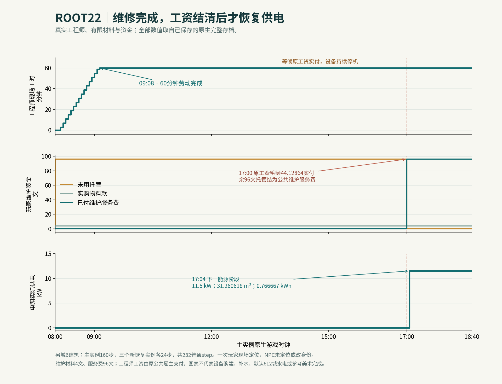
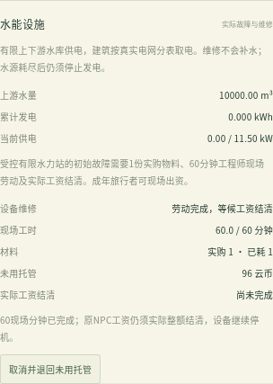
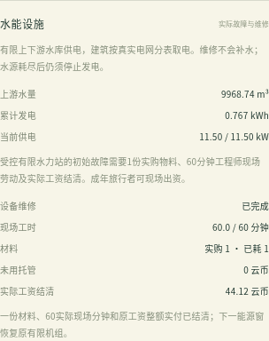

# 云山 · ROOT22 实际维护验收与接续

本轮完成了**明确声明的另城水电设备维修**：玩家现场出资、实际采购材料、原工程师步行到岗完成60分钟维修、原工资整额到账，随后下一个能源阶段恢复真实转水发电。模拟无需3D渲染器。这是完整游戏目标中的一个已验证子流程；38个需求域继续保持PARTIAL，参考图美术仍ART_FAIL，macOS实机仍NOT_RUN。

基线是开发分支 `takeover-city-life` 的 `8c7a952ed18e03905d5a15d49a2a70504d8bfb71`。本轮397功能文件＝392基线＋5新增＋7修改，无删除；实际基线全部254个测试路径逐字保留。AGENTS.md与提示词.md未改，原备忘录559645字节前缀完整保留。最新只读远端核对main仍 `70447c199e9587e379c9620a25591967e9078ee7`。本轮不创建PR、合并main或部署。

## 已实现与实际结果

`WorldDefinition.hydroMaintenance` 是可选的明确规则声明。没有声明时，旧城市、旧版电网及旧水电档不添加该域字段，也不启用设备故障。另城地图先声明六栋建筑、能源用途设施、普通材料工坊、道路、完整电网负荷与有限上下游库，再交给原构造器初始化居民、钱包、岗位和库存。

本次实际初始化有77名能源岗位工程师、玩家600、财政80000、工坊原库存90。只有一次公开玩家 `setFocus` 到能源设施门口和speed16；此为控制付款人现场的验收前提，不代表自然步行。没有修改任何NPC身体、身份、需求、钱、库存、工资额、工资日期或时钟，也没有补水。

| 实际时刻 | 已观察行为 |
| --- | --- |
| 08:00 | 旅行者合法现场申请，真实托管100；实购1工业材料，gross4/net3.68/tax0.32，原工坊库存90→89 |
| 09:08 | 原工程师citizen-3自然到岗；16个精确原工资区间共60分钟，材料耗用1；设备继续停机等工资 |
| 17:00、tick135 | 原finance整额实付gross44.12864000000007/net40.59834880000006/tax3.5302912000000055；实际工资源扣款、钱包和税队列逐笔核对；此前energy仍0 |
| 17:04、tick136 | 下一energy实际供11.5kW，转水31.260618416581718m³，上游→下游，发电0.7666666666666667kWh |

玩家100托管中的4是材料款，余96在完成时收为公共维护服务费；工程师工资仍由原公共雇主支付，不从托管重复发薪。维修不会补水、增加机组额定功率或改变冻结的初始资产。

## 来源与缺陷修正

原 `isCanonicalNpcWage` 证明现场已赚的工资债务，不能当成现金已经到账。本轮只让原people到期薪期通知、原工资队列和原finance现金writer联合颁发当前城市整额支付凭据；完整身份绑定、一次来源消费、当前owner/state/tick/clock、无该雇主旧欠薪及amount===requested都须满足。原工资事件序列化字段和金额算法保留。纯旧欠薪、部分支付、generic、复制或旧帧不能投运。旧欠薪后来全部清偿的完整维护合同仍待扩展，未冒称自然欠薪支已经运行。

静态复核还修正了两类原因：其一，extension时钟与day/hour舍入时钟合法独立，故完成既保存真实时间也保存完成tick，历史供电必须严格晚于完成时间及完成/支付tick；其二，公开可变进度或假payment不能作为热投运来源。当前完整钱料工进度有私有有界journal，所有原writer入口与time前预检都核对；完成后整域深冻结。读者只验证，成功完整onLoad才重建能力。operator的实际几何、工作点、权限及地形同时绑定保存指纹与热路径。修正前只有静态审计事实，未虚报before FAIL运行。

## 已运行检查

全部检查由root单独执行，397功能源前后SHA稳定、结束无活跃自有后代；十阶段、4M能源域及8M字符/depth24原保存限制未放宽。

| 检查 | 实际结果 | 耗时与限制 |
| --- | --- | --- |
| tsc01 | PASS | 20.261秒/cap120 |
| pure01 | 4文件73/73，0FAIL/SKIP/cancel；含17个维护组与56个原水力规则 | 4.863秒/cap120 |
| native01 | 232普通step；主160窗＋三个新恢复各24；4构造/3完整import/237完整reader | 26.506秒/cap720 |
| legacy-equivalence01 | 原4610主档与v1各baseline/candidate独立fresh进程，完整save、全部事件与phase零差异 | 21.975秒/cap540，单child120 |
| legacy-rules01 | 原劳动、电网、分表、改造、医疗9文件79/79，0FAIL/SKIP/cancel | 177.619秒/cap600 |
| build01 | 完整tsc＋vite PASS；原bundle大小警告保留 | 18.649秒/cap240 |
| ui01 | Chromium真实生产能源面板、真实DOM申请与六原PNG PASS；完整save前后核 | 7.989秒/rootcap120，child110 |

152定向规则不是全套npm test完成；历史全套OOM/取消/SKIP记录仍保留。软件浏览器面板截图没有3D渲染器，不代表GPU性能、参考美术或macOS验收。旧主档的兼容窗仅3900→3908，未新做默认城该窗钱粮因果审计，不延伸此前17:00主档的完整钱粮证明。

原始逐帧现金最大残差8.149072527885437e-10，粮食0，材料6.394884621840902e-14，水3.637978807091713e-12，电1.0658141036401503e-14。此窗实际产粮0、消耗粮125、材料生产0、公共补给转出89，不能把供电恢复说成新增产粮或经济稳态。

5个真实存档part分别写盘读取，原assembler拼装逐字等终档；缺含数组part拒绝。三种新恢复whole/rawclone/physicalParts各未来24步完整状态、全部bus参数与十phase逐字一致。删除采购、工时、payment、完成tick，或伪设备许可、身体位置的6类完整坏档保留并拒绝；generic paid1000、复制/旧earned与未成功恢复的clone不能授权。所有完整gzip写盘后解码SHA校验：编码完整save15554829B，展开173519787B；RESULT前全部实际编码原件18754014B，低于原40MiB预算，未用摘要替换完整档。

## 实际界面截图

截图来自临时验证页面调用生产CityUI与真实Simulation；分别完整恢复真实初始、等待工资、17:00实付、17:04供电checkpoint。UI独立支1构造、4完整import、0step、1公开focus、1DOM实申请；不是232步主实验的一部分，也不是连续自然GUI游玩。当前产品selectSavedWorld尚不接受此另城，自定义地图正式入口仍PENDING，验证harness没有添加该产品功能。

六张PNG为Chromium原件，未改图；每张对应完整before/after存档、DOM和实际按钮检查。另有离场禁用、到场启用、真实采购以及17:00工资已付但电仍0的截图。

## 接续与交付

[MATRIX-38.csv](MATRIX-38.csv) 完整保留ROOT21原38×27＝1026个单元格，只追加5列；没有删除原缺项或恢复用户排除的固定四阶段优先级文本。[CHECK-RESULTS.json](CHECK-RESULTS.json) 保存各guard真实结果。源码构建包与完整验证包包含原始代码、构建、源清单、完整运行记录、存档、part、事件、UI截图与独立旧版对照；每个成员写回校验，Library实际状态另存，不预先称附件已经送达。

首选默认城接续仍为ROOT20的原17:00主档 `4610ab1059b52cfd4bbfa17badf209a7a33ab986735d83b8a5da8c8a9e5ddf6a` 和World291；它们未改。另城维护接续文件为 [World原件](ROOT22-OTHER-CITY-WORLD.original.json) 与 [17:04完整档](ROOT22-OTHER-CITY-1704.save.json)，不能替代默认城经济证据。

下一窄实现先解决大图完整水电账的保守4M预算：采用明确新编码保存共享调度快照和完整窗索引，保持旧v2逐字、完整水账与每窗Flow重演，不能丢历史或放宽全保存限制。随后从默认4610原状态推进真实下一日的岗位审批、到场、产粮、供应商现金和17:00工资因果链；旧14日65.14%来源是旧代码，当前已有部分资金别名和重复裁员修复，不能强行注入补钱或自然倒闭代证稳态。

默认城有限水电声明与合法能源招聘、设备采购建造/磨损补水/电价、动态经营产权改造灾害、卫生病毒长期反馈、家庭生命周期、文化信息、真统计区与流式存档、完整参考美术及macOS实机仍有缺项。完整目标尚未完成，继续沿既有代码和这份实际证据推进。
