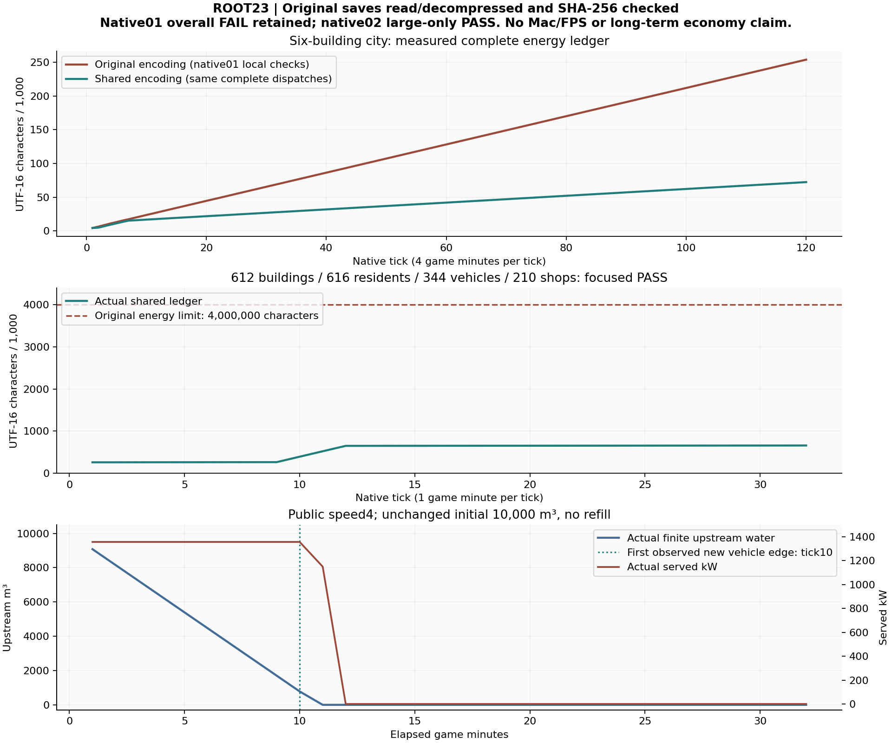

# ROOT23：完整水电账的可选共享编码

本阶段已实现并验证 `shared-dispatch-v1`：连续相同的完整调度快照共享保存，每个原水窗、历史负荷、发电量与完整17字段调度都保留，仍能从可信起点精确重演。旧地图未声明时保持原保存字段、预算、运行与事件；默认城市不被自动迁移或强启供电。

**当前结果：100/100定向纯规则、大城重点补验、三类旧存档完整对照和最终构建通过。** 第一次native验收整体FAIL及另三个辅助检查FAIL均保留；没有用后来PASS覆盖旧失败。完整38域继续PARTIAL，参考美术ART_FAIL、MacNOT_RUN、默认主城次日经济NOT_RUN。

## 实现和限额

新的9字段水电状态使用两个原分页向量：12字段快照、2字段逐窗引用。时钟与转水量直接复制原水账，grid自身原binary64发电量单独保留。仅复用相邻完全相等的快照，拒绝跳号、无引用条目、相邻重复、稀疏结构及非法数据字段。冷读取逐窗重放原水物理和Flow，读预览不授现场使用能力；完整成功host onLoad才恢复私有拥有权。

热追加精确累计当前头部和分页增量，不遍历全部历史；整个step在time与accumulator改变前，以实际当前字符和未来全新完整快照的保守结构界检查。能源域4,000,000、原live8,000,000字符/2,000,000遍历值/depth24不扩大。v4既有civicHistory16MiB归档合同独立保留，不能把所有v4整档误称8M。完整账仍有限，新大图32窗没有触及4M边界，不承诺80窗、14日或无限续演。gzip仅用于完整原件交付，不抵扣生产JSON预算。

## 实际验证

| 检查 | 本轮实际结果 | 边界和原失败 |
|---|---|---|
| tsc01 / tsc02 | FAIL后PASS | 新test可选类型收窄；未改业务或旧test |
| pure01 / pure02 | 99/100 FAIL后100/100 PASS；0SKIP/cancel | 新test错误消息matcher改为精确原拒绝原因，仍要求throw；不是全套npm test |
| native01 | 359calls，整体FAIL | 小城312步及大图32+恢复已核，但末项车辆边变化没达到；原件40,467,654B加失败记录保留 |
| native02 large-only | 47calls，PASS | 原旧2成功+第三拒、共享32、3fresh恢复各4；5构造/3成功import+3拒/60显式reader；0小城步 |
| legacy-equivalence01 / 02 | 辅助guard FAIL后完整对照PASS | 原default/v1成功16步不重跑；补维护8步和三比较；合计24步/6构造/6import/30reader，三模式各17整artifact0差 |
| build01 | PASS | 当前404功能输入完整tsc+vite，24.651868sec；原bundle大小warning保留 |

每个root gate均有原UTC、完整raw、SHA、404输入前后、PID/start-time及递归后代记录；实际owned活跃清零。详细回执见[CHECK-RESULTS.json](CHECK-RESULTS.json)，完整运行原件在本目录的ORIGINAL-VALIDATION ZIP内。纯规则前后所有业务/helper/test相同，补验仅改变新driver大城公共时间控制和case入口，不重复已通过的100规则与小城312步。

### 小城编码等价

六建筑另城正常原生初始化，两主实例各96主窗+24续窗，另外whole/rawclone/实际分块三个fresh实例各24窗，共312普通步。只在明确白名单内展开共享编码并证明两owner World仅标记不同，再映射各自可信指纹；其他完整state/runtime/钱/身体/任务、ALLbus参数和十阶段逐字相同。实际恢复和未来24全save严格相等。此局部证据属于整体FAIL的native01，不冒称其全局通过。

| 实际最大字符 | 原编码 | 共享编码 |
|---|---:|---:|
| 完整保存 | 627,350 | 445,888 |
| 水电账 | 253,987 | 72,436 |

### 大城补验和原失败原因

原World291全部612建筑/674路网节点/691边/11城区完整保持，正常构造616居民、344车、210店。只在fresh构造前为既有core-energy-south独立声明有限水电资产，初始10000m³/head10/efficiency.9、12电节点/11馈线与完整负荷保持；不是导入或强改默认主档，也不是设备购建或自然招工验收。

旧保守预算1,390,080字符/窗只准2窗，第三调用在整个step/time/accumulator前拒绝，完整state/runtime/clock/tick/ALLbus/phase不变。初次新编码32窗采用公开speed1仅观察480→488，车虽真实移动但尚未跨边；最快85.5239m支路车辆progress.976569，末项严格跨边断言FAIL。没有减弱断言或造新位置。

独立补验仅改双方公开speed4，仍每次普通step(.25)，每窗1游戏分钟；480→512共32窗。实际tick10/489.99999999999994首次观察原车辆新的edge，全部344分表有4种edge观察；history32/snapshots4。末水电账658,078字符；最大全档2,820,551UTF16/2,836,185UTF8B、visited217,796/depth12。终窗上游0、下游10000.000000000002m³、245.25kWh、供电0，原有限水自然耗尽，没有补水。这是本有界窗观察，不冒称夜间/停业/完整枯水专项或经济稳态。新预算边界在32窗为BOUNDARY_NOT_REACHED。

actual120个原生分片独立落盘、读回SHA、assemble全字节等checkpoint4；删真实含数组part拒绝。三个fresh实例从whole/rawclone/physicalParts导入，未来各4步全save/ALLbus/phase逐字同主。缺snapshots、改原kWh、丢水窗的coldpreview与import都拒绝且live不变；合法coldclone没有hot能力。全save原gzip18,482,886B、解码129,846,727B；全部physicalOriginal23,074,349B，低于原80MiB实验cap。

图由278个完整原save读盘、解码和raw/encoded SHA核验取数，无新增Sim；[CSV](ROOT23-ACTUAL-HISTORY-DATA.csv)和[生成回执](ROOT23-ACTUAL-HISTORY.receipt.json)保留。这是实际数据图，未宣称3D截图或macOS性能。ROOT22既有六阶段实际维护面板截图仍在其原交付目录，没有因UI源未改而重跑。

## 矩阵、交付与接续

[MATRIX-38.csv](MATRIX-38.csv)保留ROOT22全部38×32原单元格，仅加5列；[保留回执](MATRIX-PRESERVATION.json)给出原1216data cells和32headers验证。所有38域仍PARTIAL。全部257原test路径、AGENTS/提示词及571269B备忘录原前缀保持，代码397+7NEW+1MOD−0DEL=404。

本目录保存报告、数据图/CSV、终态World与完整save、源码及构建ZIP、所有成功/失败原件ZIP、功能SHA、实际检查回执和HANDOFF；ZIP每成员完整读回核SHA，不删失败、原水账、车、店或事件。包在提交收尾前封存，最终Git提交/推送结果以实际readback为准。

Library先前14项上传在prepare之前连接错误失败，0新LibraryID、memo替换未发生；本阶段新原件尚未送达，没有对同一已开始批次直接fallback或自动retry。当前技能规则和原错误位置见[LIBRARY-DELIVERY-STATUS.json](LIBRARY-DELIVERY-STATUS.json)。GitHub开发分支提交与Library附件是两项真实状态，不能互相冒充。

下一步从原World291+4610主档按公开speed16普通360步到次日17:00，核现金别名/所有escrow、财政、原工资债、真实出勤和完整食品保管。ROOT24只读方案为NOT_RUN/RESOURCE_PROOF_PENDING：须先编制新续档adapter并明确失败原件和事件的容量边界。旧14日现金下降65.14%属于旧源码，不能代证当前仍同故障或当前已稳态。

正式自定义地图GUI/真实地图和动态拓扑、默认合法能源建设/岗位/补水/电价、完整设施生命周期/居民驱动改造/灾害病毒、家庭文化日常全链、统计区流式产品、参考美术和Mac实机继续按矩阵欠项推进。
