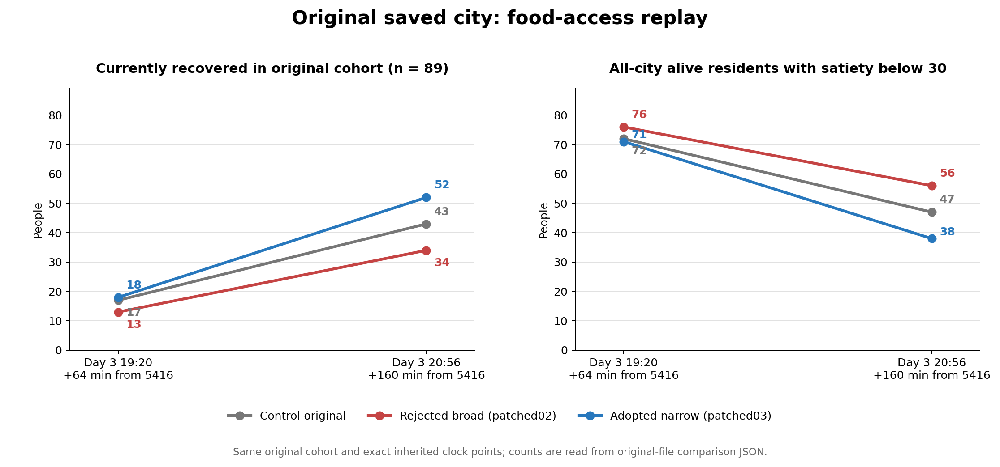

# ROOT26：就餐时序与居民出门

本轮修复了接近餐点的低饱足居民因处理间隔过长错过有限库存，以及床侧新增方块重叠后无法出门的问题。同一原始存档、同一89人群体、同一5576时刻，恢复人数从43增至52，全城低饱足人数从47降至38。相关最终源码检查去重103项通过，构建通过。



这是原件统计图，不是游戏画面或美术验收截图。原始城市为World291/current-v6旧存档；没有把它当作当前默认v8新城市验收。较宽的调度候选使结果下降，已弃用；失败、加载错误和超时原件都保留。

- [阶段报告](REPORT.md)：实现边界、真实销售、守恒、失败与剩余问题。
- [38项需求矩阵](REQUIREMENTS-38.csv)：保留旧47列，追加本轮5列；全部38域仍为PARTIAL。
- [封存索引](artifacts/index.json)：所有分卷、文件SHA和字节数。每组所有分卷都需要，解压至同一新目录。
- [同钟比较](comparison.json)、[实际销售阶段证明](sale-phase-proofs.json)、[最终检查名称与回执](FINAL421-CLOSED-GATES-READONLY.json)。

`scripts/food-access-recheck.ts`只读原始完整存档、事件、十阶段钱粮快照和分块原件，重算并拒绝篡改；它不运行Simulation。原始观察器、运行器、各次冻结源码及失败样本随封存分卷交付。不得将负样本导入后当作自然续跑。

解压全部分卷后，在本仓库安装已有依赖，以下命令重检收窄方案的两段原件；`evidence`为解压目录，输出文件必须尚不存在。旧对照可单独按native01至native04次序重检，不能与patched链混接。

```bash
npx tsx scripts/food-access-recheck.ts evidence/rechecked-narrow.json evidence/actual/patched03 evidence/actual/patched04
```

下一步从[真实接续原档](NEXT-COLD-INPUT.save.json.gz)（解压后SHA `bbaa6a7a5e0bfcda107d22e62a820c6aa65336b3e0a48266f00846e2306dad29`）、clock5608/tick2137接续，检查合法夜间供餐、有限供给分配及原payrollAt6780结算。此档也在patched04原件组的末帧中。419源码40主窗与421源码另8主窗是两来源接续，不能合称单一最终源码48窗验收。

完整游戏仍未完成：14日经济稳态、正常第一人称综合旅程、艺术质量、macOS实机和其他家庭、能源、医疗、教育、政治、科技、病毒、灾害、建造等完整要求仍按矩阵推进。本轮没有新增GPU或macOS验证。
