# 云山美术与渲染改造方案（终稿）

> **状态**：设计文档，等待用户确认，没有实施。本轮没有改动仓库（没有改 `src/`、`tests/`、`scripts/`、`unity/`、`docs/`，没有提交或推送）。
>
> **仓库实况**：分支 `claude/focused-tesla-ls4bw6`，HEAD `18c088a`，`git status` 干净。任务描述说 `npc-motion-coarse-v1` 是"未提交实验"，实际它已在 `1dc78b2` 提交，以仓库为准。
>
> **证据边界**：
> - 网页截图来自 vite preview + Chromium SwiftShader（软件渲染，1672×941）。它们只能证明"画面长什么样"，**不能作为任何性能证据**。
> - 本容器没有 Unity。文中所有 Unity 条目只经过代码阅读，**没有编译着色器、没有渲染过一帧**，必须由用户在 Mac 上确认。
> - 文中数字都标了来源脚本。标"推算"的没有测过。
>
> **本稿修订**：初稿（`art-plan/美术渲染改造方案.md`）被两位评审各判一个致命问题，另有 21 个重大问题。§9 逐条列出处理结果：接受、修正或拒绝，并附证据。

---

## 0. 结论

### 0.1 为什么丑：四个根因，缺一不可

初稿说"主因不在资产，而在世界形状"。这个判断**不成立，已撤回**。反证是我们自己最好的镜头 `d-core-waterfall`：那里已经有深谷、陡崖和竖直瀑布，画面依然不像概念图（见 §1 图 3）。

所以根因有四个，必须一起解决：

| # | 根因 | 一句话证据 |
|---|---|---|
| R1 | **建筑类型错了**：现代米黄板楼和塔楼，满墙窗格 | 全城 612 栋楼，楼层分布为 ≤3 层 192 栋、4–5 层 149 栋、6–9 层 195 栋、10–15 层 70 栋、16 层以上 6 栋。高度中位数 19.2 m，p90 是 39.6 m。学苑中位数 23.8 m，最高 44.2 m。天枢是 234 m 的阶梯塔。概念图里是 1–3 层殿堂，叠重檐 |
| R2 | **世界形状错了**：缓坡上的稀疏散点 | 学苑 56 栋楼摊在半径 395 m 的圆盘上，建筑覆盖率 19.6%，楼底高程 p10 到 p90 只差 63 m。概念图是约 300 m 见方的崖台，高差 150 m 以上 |
| R3 | **渲染方式错了**：平滑地形、平光、奶白雾、中景没有层次 | 地形是平滑的平面着色壳，不是 0.2 m 体素岩。高光为 0%，亮度标准差 22–23。远景用盒子，概念机位上 100% 是远景层 |
| R4 | **中景内容缺失**：玩具树、没有屋檐、没有灯、没有字、没有云 | 远景树是"两块冠 + 0.8 m 干"，屋顶是 1.2 m 高的零出檐棱柱，灯笼不发光（GLB 自发光为 0） |

**R1 和 R2 都只能靠重建世界解决**，也就是与路网方案共用的新布局 `current-v8`。**R3 和 R4 的一部分可以先做**，旧布局也受益，但单做这一部分不会让画面"像概念图"。

### 0.2 初稿的致命矛盾，现在怎么解

**矛盾**：初稿要求"学苑建筑容量不变"，同时要求"低矮殿堂挤满 320×320 m 的崖台"。评审算出：学苑总楼面 643,171 m²，按 3 层计需要约 214,000 m² 占地，是核心区面积的 209%。

**重新测量后的事实**（`final/probe/cap.mts`、`final/probe/occ.mts`）：

- **楼面积不是约束。** 学苑 28 栋住宅只住了 **56 名模拟居民**，每栋最多 2 人；这 28 栋住宅的 `capacity` 加起来是 6,608。21 个工作地点共雇 116 人，单栋最多 57 人。
- **全城也一样。** 所有建筑的 `capacity` 加起来是 173,717，实际模拟居民只有 616 人。
- **`capacity` 是派生值**，算法是 `floors × floor(width×depth/32)`（`src/world.ts:551`）。它真正参与判定的地方只有两处：
  - 店铺雇员上限 `min(100, capacity)`（`src/simulation.ts:1497`）；
  - 家庭住宅容量检查（`src/simulation/family.ts:233`、`building-alteration.ts:216`）。
- **区统计人口 `district.population`**（全城 23,256）是独立数据，不由楼面积推出。

**结论**：v8 可以把楼面积降一个数量级，模拟玩法不变。需要守住三条硬门槛，写进 v8 测试（§6 G2-3）：

1. 每个工作地点的 `capacity` ≥ max(100, v6 实测峰值雇员 × 2)。这样雇员上限 `min(100, ·)` 在 v8 里仍然不起作用。
2. 每栋住宅的 `capacity` ≥ 2 ×（居民数 + 孕期预留）。
3. 每栋楼各类功能点（床、工位、课桌、诊位）的数量 ≥ v6 实测的同时使用峰值。

做法是把 `capacity` **改为 v8 布局里的显式字段**，不再由楼层和面积推出。这样会改世界指纹，所以只对 v8 生效；v6 存档和夹具不变。

这里仍然需要用户拍板（A0-1）：**"23,256 人的城市"叙事上住在哪里**。建议：住宅改成 2–4 层的台地院宅和吊脚楼；核心区和市集允许少量 5–7 层楼阁；只有天枢保留高层，并改成宫殿造型（§3 S8）。

### 0.3 第一步做什么

**阶段 A1（不改世界）**：光照与大气、调色、远景剪影环、灯笼发光、顶层屋面的显示壳。

- A1 的第一项是**原型标定**。初稿说"A1 能达到目标的一半"，那只是猜测。本稿做了一次运行时注入原型（§2.4），只改光照、雾和屏幕调色，结果如实记录在那里。
- 原型的结果：暖色和对比度很快上去了（暖色 0→6–13%，亮度标准差 22→38–58），但 `a2` 和 `a1` 变得又暗又浑，`f` 仍是草坡上的板楼。所以 **A1 是必要的，但它只能让画面"有光"，不能让画面"像概念图"**。
- A1 的验收门槛按实测重新设定，不再沿用初稿数字，并且加上了上下限。

**Unity 侧**：A1 **不迁移 URP**。在内置管线上加后处理即可做到 bloom、调色和暖光：可以用 Post Processing Stack v2，也可以自写 `OnRenderImage` 通道。URP 迁移推迟到 A3 之后单独评审（§4.1）。

### 0.4 人群：正午人少，渲染改不了

实测数据：概念图时刻 11:45 前后，学苑 250 m 内**室外居民为 0**（§1.3）。

- 渲染插值和扩大可见半径，只能显示已经在室外的人。
- 人口翻倍，0 还是 0。
- 唯一能改变正午室外人数的办法是**作息与活动设计**：课间穿院、午饭外出、户外课、市集外摆。这是模拟规则的改动，属于用户决定（A0-3）。

**不画装饰假人。**

---

## 1. 差距诊断

### 1.1 并排证据

截图在 `img/`（软件渲染，只作画面证据）。

| 图 | 内容 | 说明 |
|---|---|---|
|  | 概念图 2.jpg 的中央场景区（x 25–80%、y 22–86%），裁掉了 UI 卡片和天空 | 用于重新标定像素目标（§2.3） |
| 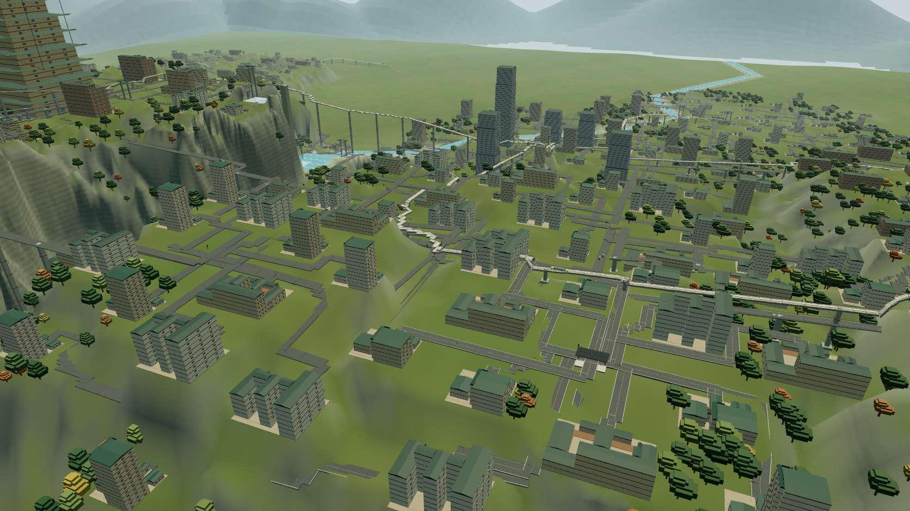 | 图 1：用概念图角标坐标 (-590, 498, -901) 实拍 | 离地 466 m，最近的楼 341 m，读起来像地图。草地占全图 24.6%、中央区 39.1% |
| 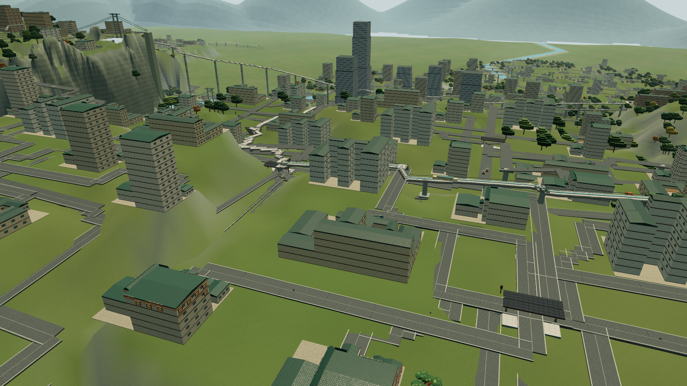 | 图 2：学苑无人机近景 | 绿草平原上的米黄板楼和塔楼，沥青路网，楼底是米色垫块。高光 0%，中央区亮度标准差 22.7 |
| 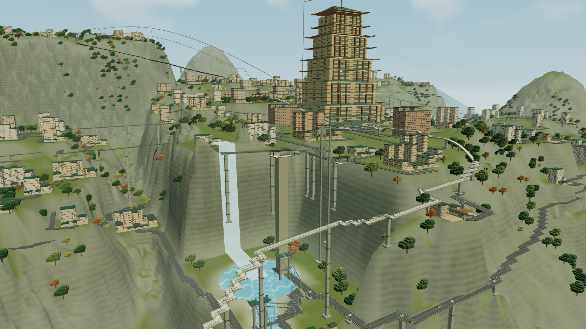 | 图 3：天枢瀑布峡谷 | 有深谷和崖，但岩是平滑灰绿斜面，楼是板楼，天枢是阶梯塔，树是两块盒子。这张图证明**地形起伏单独解决不了问题** |
| 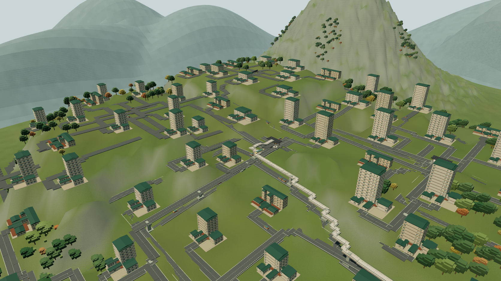 | 图 4：松风里住宅山坡 | 草地 33%（中央区 43%），没有台地，楼间距 30–80 m |
| 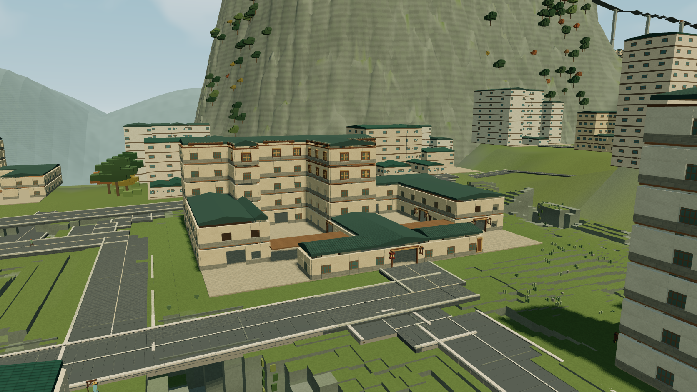 | 图 5：书院低空 | 近景细节确实存在（门口灯笼、门牌），但屋顶是扁平深青小坡顶，没有出檐 |
| 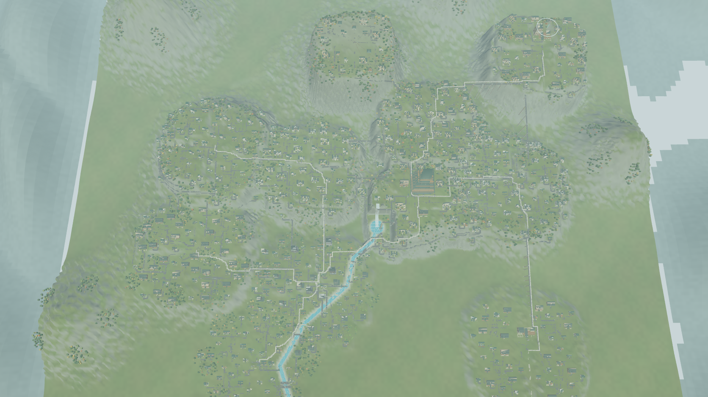 | 图 6：3,350 m 正俯视 | 各区像平原上的薄饼，亮度标准差 12.4（1.webp 约 55），世界边缘外露 |
| 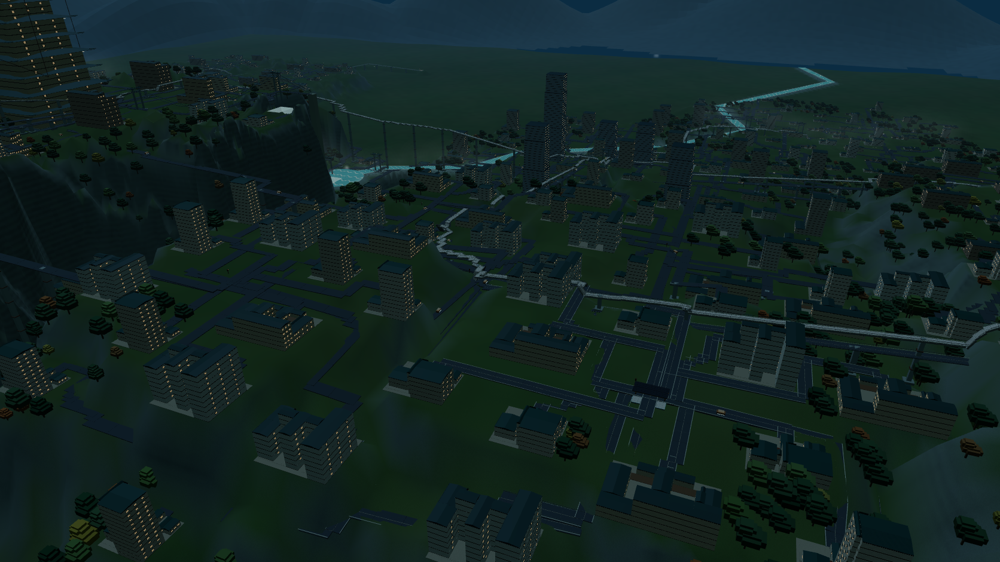 | 图 7：夜景 | 86% 像素近黑，没有万家灯火 |
| 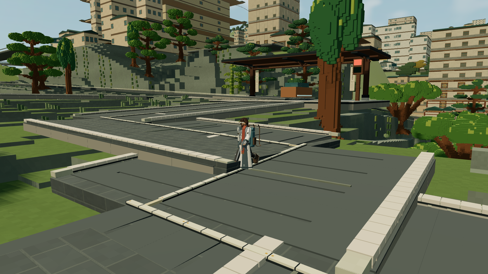 | 图 8：居民近景 | 工坊人物和树近看质量不错，问题出在中远景 |
| 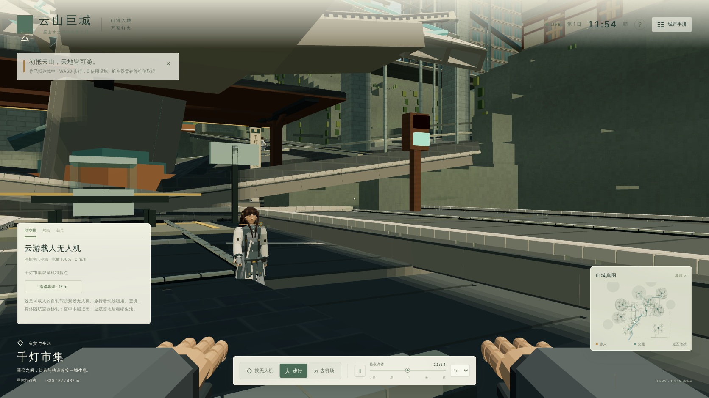 | 图 9：开场第一眼 | 头顶是巨大的灰色站台板，第一人称手臂占屏 |

### 1.2 差距表（按画面影响排序）

| # | 可见差距 | 根因 | 代码与数据 |
|---|---|---|---|
| 1 | 没有中式殿堂，全是板楼和塔楼 | R1 | 楼层直方图见 §0.1（`review-adversarial/artplan-heights.mts`，本轮重跑确认）。屋顶区每块 `top = ceilingY + 1.2`，没有出檐（`src/architecture-floor-plan.ts:670-682`，gable 在 `:679`）。每栋楼的屋顶区中位数是 8 块，跨度中位数 5.6 m。曲线歇山生成器（`src/architecture-layout.ts:14-47`）只给天枢和 6 座亭用。Unity 远景是平盒（`unity/Assets/Yunshan/Core/CityGeometry.cs:123-141`） |
| 2 | 平原散点，没有台地 | R2 | 学苑覆盖率 19.6%，p10/p50/p90 楼底高程 173/201/236 m（`art-plan/relief.mts`）。每栋楼有一条私有入户路（`src/world.ts:594-598`） |
| 3 | 地形是平滑斜面，不是体素石崖 | R3 | 地形是连续平滑壳，远处按 16 m 插值（`src/rendering/terrain.ts:150-221`）。台阶式崖面只在相机离地 <100 m、±96 m 内出现（`:349-365`）。城区和野外共用同一套草色顶点色（`:68-97`） |
| 4 | 光平而冷 | R3 | 主光强度在 `src/renderer.ts:918` 动态设置为 `daylight × 2.9`，补光是 `.68 + daylight × .45`，比值约 2.6:1。颜色固定为 `#ffeac4`。没有 bloom；阴影 512²、±100 m（`:178-180`），只有 140 m 内的近景块投影（`:944`）。Unity 太阳色只在白天与夜蓝之间插值（`CityBootstrap.cs:380-381`），后处理为 0 |
| 5 | 没有云海、远景山城，雾是均匀奶白 | R3、R4 | 雾密度 `(.00022 + …) × 6500/distance`（`renderer.ts:933`）。远山是 23 个高斯峰单色壳（`terrain.ts:256-261`）。Unity 在 ±2.2 km 处截断，没有远山 |
| 6 | 细节只到 120–230 m | R3 | 近景块 120 m/12 块，高画质 230 m/18 块（`src/rendering/chunk-residency.ts:6-7`）；建筑细部 180 m、8 栋（`architecture-detail.ts:6-8`）；Unity 近景按玩家脚下而不是相机（`CityBootstrap.cs:239-258`） |
| 7 | 树稀疏、像玩具 | R4 | 5,200 棵树里只有 175 棵在各区 0.6 半径内（`src/rendering/woodland-layout.ts:58-79`）；远景树是两块冠（`terrain.ts:296-301`）；工坊树 160 m 内最多 120 棵（`woodland-models.ts:14`） |
| 8 | 没有人群 | 模拟作息 + 渲染范围 | 见 §1.3。骨骼人物 45 m/20 人（`studio-characters.ts:17`）；Unity 帧半径 260 m（`sim-host.ts:142`）；30 m 瞬移规则（`CityLifeView.cs:97`） |
| 9 | 水平板，瀑布像贴片 | R3、R4 | `d` 里的瀑布**视觉上接近竖直**，但数据 top (110,256,-105)、bottom (110,103,35) 水平相距 140 m。两者的关系是：着色带被画在崖面上，而水的数据路径是斜的，所以 ENV-028（24×153 m 竖直水帘）放不上数据路径。Unity 水着色器忽略顶点色（`Water.shader:22`） |
| 10 | 标志物缺失：匾额、灯笼排、缆车、玻璃电梯、拱桥 | R4 | 门牌最多 8 栋（`architecture-detail.ts:500-529`）；缆车厢离缆索约 4.4 m（`network-structures.ts:26`、`vehicle-shapes.ts:11`）；GLB 灯笼自发光为 0 |
| 11 | 色板单调 | R3 | 远景色板去饱和（`renderer.ts:30`、`architecture-bodies.ts:87,104-105`） |
| 12 | 道路统治街面 | R2 | 10 m 宽坡道盒带（`network-structures.ts:42-55`），根治见路网方案 |
| 13 | 开场第一眼差 | 布置 | 出生点在千灯市集站台下 |
| 14 | 夜里没有灯火 | R3、R4 | 网页没有 bloom、街灯；Unity 窗光是顶点色 × tint，窗格顶点色是青色，所以夜窗发暗橄榄色（`VertexColorLit.shader:31`） |
| 15 | 总览不像卫星图 | R1、R2 | 各区覆盖率 10–25%，1.webp 近乎被屋顶铺满；外圈没有农田台地和森林 |
| 16 | UI 与概念图不一致 | UI | 概念图有地图卡、时间轴、导航卡、区名卡；我们的印章错位（`src/style.css:102-115`），顶部渐变把画面洗白（`:92`）；Unity 是 IMGUI 默认皮肤 |
| 17 | 学苑的功能构成不像书院 | 布局 | 文澜学苑 56 栋楼里有 14 所学校、28 栋住宅、**14 所医院**。概念图里看不到医院和塔楼 |

### 1.3 人群实测（修正了初稿的标注错误）

数据来自 `art-plan/crowd.mts` → `crowd.json`：1 个游戏日，1 个种子，焦点固定在学苑，每游戏小时采样 1 次，"室外"用楼包围盒近似判断。

**初稿的两处错误已更正：**

- "395 m 半径内"那一行，实际统计条件是 `districtId === 'academy' || d < 395`，所以把"家在学苑"的人也算了进去，不论他们身在何处。这一行已改名为"学苑居民或 395 m 内"。
- "8:00 峰值 56 人"来自第 2 天的样本（t=720）。第 1 天 9:00 只有 25 人，而且第 1 天 8:00 是启动时刻，所有人都在室内，是启动瞬态。每小时只有 1 个样本，所以"峰值只持续约 1 小时"**无法判定，已删除**。

| 范围 | 全天平均 | 10:00、11:00、12:00 |
|---|---|---|
| 学苑中心 250 m 内，室外 | 10.5 | 0、0、0 |
| 学苑居民或 395 m 内，室外 | 15.6 | 0–2 |
| 全城室外 | 117 | 58–100 |

**结论**：正午学苑室外为 0，这是作息造成的，不是渲染造成的。人口规模、作息和户外活动交给用户决定（A0-3）。验收里的人群指标改为"如实统计 V1 视锥内的模拟居民"，不设硬目标。

---

## 2. 目标视觉规格（可测量）

### 2.1 验收机位与构图模板

**V1 不再"从 v8 数据推出机位"。** 初稿那样定义，机位会跟着 v8 的结果去凑，验收就成了自我参照。改为**先固定构图，再让世界去满足它**。

构图模板直接从 2.jpg 测出。坐标是画面比例，原点在左上，宽和高各为 1：

| 元素 | 2.jpg 中的位置 | V1 要求 |
|---|---|---|
| 前景门楼与竖幡（文澜学苑） | x 0.10–0.22，y 0.42–0.68 | 前景左侧有一处带竖幡的门楼或崖墙 |
| 中轴石阶梯街 | 从 x 0.30、y 0.95 到 x 0.45、y 0.55 | 一条从画面下沿通向中央殿群的阶梯街 |
| 殿群主体（格物殿） | x 0.45–0.62，y 0.35–0.52 | 画面中央 1/3 有 ≥ 3 座重檐殿堂，叠在 ≥ 2 级台地上 |
| 玻璃电梯塔 | x 0.69–0.73，y 0.50–0.85 | 中右区域有一座竖直的电梯塔 |
| 索道与缆车 | 从 x 0.62、y 0.27 到 x 1.0、y 0.38 | 右上有一段带缆车厢的索道 |
| 远景山城和云带 | y 0–0.40 | 至少 2 层，近层带建筑轮廓，远层只剩剪影 |
| 银杏 | x 0.28–0.33，y 0.50–0.62 | 前中景有 ≥ 1 棵黄色树冠 |

**机位参数**（按画面比例推算）：竖向 FOV 48°，焦距约 1,057 px。前景人物约 15–20 px，对应距离 90–120 m；格物殿约 330 px 宽，对应约 130 m。所以**相机距离中央殿群约 130–180 m，俯角约 20–25°**。

角标坐标 (-590, 498, -901) **不是真实机位**，用它实拍出的 `a1` 是一张地图。它降级为 V2，只要求"整区可读"。

v8 的学苑布局必须让 V1 机位满足上表。脚本自动检查每个元素的投影是否落在指定范围内（±0.05）。不满足就是布局不合格，**不允许为了凑数据去改机位**。

| 机位 | 定义 | 对照 |
|---|---|---|
| V1 | 按上面的构图模板 | 2.jpg 中央场景区 |
| V2 | (-590, 498, -901) 看向学苑中心 | 整区可读 |
| V3 | 3,350 m 正俯视 | 1.webp |
| V4 | 梯街 1.7 m 眼高 | 验收②（第二阶段） |
| 回归 | 现有的 `c1`、`d`、`e1` | 防止倒退 |

### 2.2 时段与光照

概念图 HUD 写的是 11:45，但光是金色斜阳。所以**暖光是美术指向，不是时刻**。

**显示用的太阳仰角压缩**：白天最大仰角 34–38°，方位不变。模拟的时间、天气和作息都不改。

| 参数 | 规格 |
|---|---|
| 太阳颜色 | 仰角 <8°：`#ffa65a`；8–25°：`#ffc684`；>25°：`#ffd29a` |
| 主光与补光比 | 晴天 ≥ 4:1（现在约 2.6:1）；补光偏冷 `#9fb7c9` |
| 阴影 | 无人机视角下 ≥ 600 m 有投影 |
| 色调 | ACES；高光偏暖、阴影偏青 |
| Bloom | 阈值约 1.0（HDR），只让灯笼、亮窗、水面高光溢出 |
| 夜 | 窗光用固定暖色 `#ffb661`，灯笼芯 HDR 亮度 4–8 |

这些参数存成共享表 `time-of-day-grade`（TS 加导出 JSON），网页和 Unity 读同一份，并做一致性测试。

### 2.3 像素指标：按区域重新标定

**初稿的错误**：目标是对全图 2.jpg 计算的。全图包含天空和白色 UI 卡片，高光 21.7% 里大部分来自顶部 20% 的天空和卡片，那一带的高光高达 53.6%。

**本稿做法**：在同一个中央场景区（x 25–80%、y 22–86%）上，对概念图和我们的截图使用同一个 `imgstats.py`。天空和远景带另设指标。

| 指标（中央场景区） | 概念 2.jpg | 现在 `a2` | 现在 `a1` | 现在 `d` | A1 门槛 | 最终门槛（V1） |
|---|---|---|---|---|---|---|
| 草地（**语义覆盖率**，不再用色相） | 约 1–2%（目测，待手工标注） | 39.5%（色相法） | 39.1%（色相法） | 7.7%（色相法） | 记录，不设门槛（A1 不改地面） | ≤ 5% |
| 高光（v > 0.85） | 6.9% | 0.0% | 0.0% | 0.0% | ≥ 1% | 4–10% |
| 亮度标准差 | 48.3 | 22.7 | 21.6 | 34.1 | ≥ 30 | 42–55 |
| 暖琥珀 | **10.9%** | 0.0% | 0.2% | 2.8% | ≥ 4% | ≥ 8% |
| 阴影（v < 0.2） | 4.5% | 2.2% | 1.0% | 0.7% | 2–12% | 2–8% |
| 平均饱和度 | 0.29 | 0.32 | 0.31 | 0.25 | 0.22–0.36 | 0.24–0.34 |

另外三项单独计算：

| 指标 | 对照值 | 门槛 |
|---|---|---|
| 顶部 20% 天空带 | 概念图高光 53.6%，亮度标准差 62 | 只要求有云和远景层次（≥ 2 层剪影），不追高光 |
| V3 总览对比度 | 1.webp 约 55；现在 `b` 是 12.4 | ≥ 40 |
| 夜景 `e1` | 现在近黑 86% | 近黑 ≤ 65%，暖光像素 ≥ 5% |

区间型门槛有上限，用来防止"把雾和天空调白"来刷指标。**像素指标只是必要条件，最终由用户在并排图上判定。**

### 2.4 A1 原型（运行时注入，不改仓库）

**做法**：脚本 `final/probe/a1proto/a1proto.mjs` 在已经构建好的 `dist` 页面里包装 `city.update`。每帧在原逻辑之后覆盖以下参数：

- 太阳仰角上限 36°，颜色按 §2.2；
- 主光 ×1.34，补光降到约 0.3–0.54，地面反光降低；
- 暖色地平线雾，雾密度 ×0.55，曝光 1.12；
- 画布再加一个 CSS 调色滤镜（contrast 1.18、saturate 1.12、sepia 0.10），**仅作为 LUT 和分离调色的替身**。

没有加 bloom、没有改色板、没有改地面，也没有加檐壳，所以这是 A1 的**下限**。

**结果**：中央场景区，`imgstats.py`。截图在 `img/a1proto-*.png`，均为软件渲染。

| 镜头 | 草地 前→后 | 暖色 | 亮度标准差 | 高光 | 阴影 | 平均饱和度 |
|---|---|---|---|---|---|---|
| `a2` | 39.5→6.5% | 0.0→8.1% | 22.7→38.9 | 0→0.3% | 2.2→**26.3%** | 0.32→**0.60** |
| `a1` | 39.1→1.8% | 0.2→6.2% | 21.6→38.5 | 0→0.1% | 1.0→**31.1%** | 0.31→**0.61** |
| `d` | 7.7→1.4% | 2.8→12.6% | 34.1→58.2 | 0→9.4% | 0.7→16.5% | 0.25→0.51 |
| `f` | 43.4→1.5% | 0.5→12.1% | 26.6→41.5 | 0→5.4% | 0.5→6.2% | 0.35→0.63 |
| 概念 2.jpg | 1.6% | 10.9% | 48.3 | 6.9% | 4.5% | 0.29 |

| 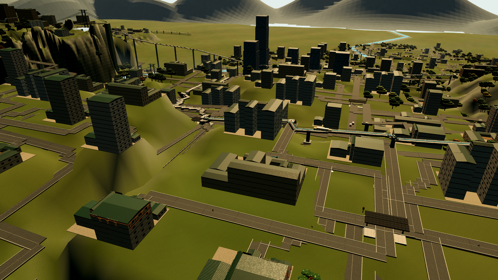 | 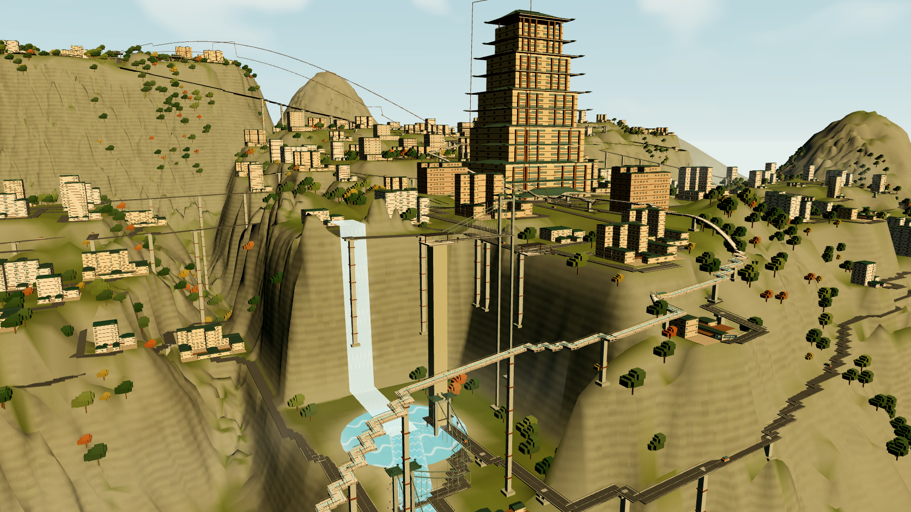 | 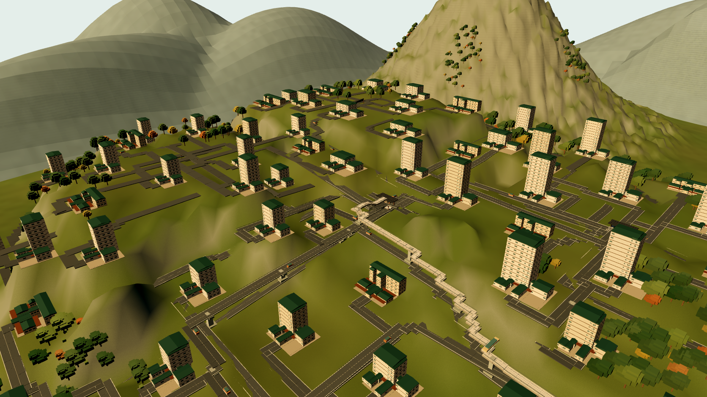 |
|---|---|---|
| a2 原型：暖了，但变得又暗又浑，草成了橄榄色 | d 原型：峡谷可读性明显变好，有暖光和高光 | f 原型：暖了，但依然是草坡上的板楼 |

**结论（如实记录）**：

1. **光和调色能很快推动暖色和对比度**：两项分别从约 0 升到 6–13%，从 22–34 升到 38–58。初稿"A1 能达到一半"的猜测，在这两项上偏保守。
2. **但画面并没有因此更像概念图。** `a2` 和 `a1` 主观上变差了：阴影占 26–31%，饱和度翻倍到 0.6，概念图只有 0.29。`f` 依然是现代板楼。这再次证明 R1 和 R2 是主因。
3. **"草地像素"这个指标可以被刷**：原型只是把草的色相推成橄榄色，草地像素就从 39% 降到 2–7%，地面本身一点没变。所以 G1-1 **不再使用色相草地指标**，改用场景数据的**语义覆盖率**：由渲染端的 ground-type ID 缓冲，或者 CPU 端统计视锥内可见的地面三角形，分出草地、石铺、屋顶、树冠、水各占多少。
4. 因此 A1 门槛**必须带上下限**：饱和度 0.22–0.36，阴影 2–12%，亮度标准差 ≥ 30。参数要和色板换色（W2）一起调，不能单靠全屏调色。
5. 原型没有 bloom，CSS 滤镜也不等于真正的 LUT。所以以上只是方向性证据，**不是 A1 的验收结果**。

### 2.5 剪影、密度与构图规则（V1 视锥内由脚本计数）

| 内容 | 现在 | V1 门槛 |
|---|---|---|
| 殿堂类建筑（1–3 层主体，带坡屋面） | 0 | ≥ 10，其中 ≥ 3 座重檐 |
| 高于 5 层的建筑出现在画面中央 60% | 多栋 | 0（天枢除外） |
| 可辨台地或崖墙 | 0 | ≥ 4 级，每级高 3.6 m 的整数倍 |
| 体素树 | 约 150 棵盒树 | ≥ 80 棵，≥ 1 棵银杏，≥ 10 处垂藤 |
| 发光灯笼 | 2 | ≥ 40 |
| 可读匾额或竖幡 | 0 | ≥ 3（文澜学苑、格物、笃行） |
| 云雾 | 0 | 占画面 5–15%，位于崖间 |
| 交通标志物 | 细灰线 | ≥ 1 个缆车厢挂在索上，以及电梯塔 |
| 居民 | 0 | 如实统计，不设硬目标（§1.3） |

**V3 卫星图**另设三条门槛：

- 区内屋顶覆盖率（区边界内的屋顶像素）≥ 45%。1.webp 的对照值要在 A0 阶段用手工区界测量，**目前还没有测**。
- 区外 ≥ 60% 的山坡像素是林地或农田台地。
- 能辨认跑道和红色天枢宫。

---

## 3. 共享数据与几何（TS 是权威，C# 移植，两个客户端共同受益）

### 总原则

- **只在 `current-v8` 里改世界**，与路网方案共用。开发期用不注册的配方 `dev-v8`。`CURRENT_CITY_LAYOUT` 保持 `current-v6`，旧存档和夹具不变。
- **碰撞、行走和楼层平面与看到的东西一致。** 只有标为"显示用"的部件可以不进碰撞，测试保证它们不进入任何可行走空间（规则见 S3）。
- **不改个体速度、资金来源和时间条件。** 路线变长或变短来自真实几何，在审计里如实报告。

### S0 建筑类型与容量预算（新增，解决致命问题）

1. **`capacity` 改为显式字段**，满足 §0.2 的三条门槛。
2. **每类建筑的类型与层数上限**（需用户在 A0-1 确认）：

| 类别 | v8 类型 | 主体层数 | 说明 |
|---|---|---|---|
| 书院、学堂 | 殿堂院落：门屋、主殿、两厢、连廊 | 1–3 | 主殿重檐 |
| 官署、会馆、银行 | 殿堂或楼阁 | 2–4 | |
| 医馆 | 院落医馆 | 2–3 | **学苑里的 14 所医院**：方案 a 保留数量，改成院落医馆；方案 b 迁 8–10 所到市集或住宅区，涉及就医距离和经济，**需用户决定（A0-2）** |
| 住宅 | 台地院宅、吊脚楼 | 2–4 | 现在最高 13 层，而学苑每栋住宅只住 1–2 人 |
| 市集 | 骑楼铺面 | 2–3 | |
| 核心区楼阁 | 楼阁 | ≤ 7 | 少量 |
| 天枢 | 红色宫殿，多重台基与重檐 | 尺寸可降 | 原尺寸 144×112×234 m；是否保留高度由用户决定 |

3. **每栋楼仍是独立的模拟建筑**。院落是**多栋独立建筑的组合**，比如学苑 56 栋楼编成 10–12 组院落。这样不会出现"一栋楼的楼层平面拆成多块"的情况，楼层平面里每层一个楼梯、一个主体的假设保持不变（`getFloorPlanStairPosition`，`architecture-floor-plan.ts:289`），**NPC 室内运动不受影响**。院内的连接全部是室外步行网络。
4. **朝向**：现有产品建筑的 `rotation` 全部为 0（`world.ts:551` 写死）。很多代码路径假设包围盒与坐标轴对齐，例如地形切割和人群探针。v8 第一版**保持 rotation 为 0**，靠布局让门所在的 +z 面朝向街道或下坡。台地的走向据此规划，崖面朝 +z。允许 90° 旋转是后续的独立条目，需要先审计所有轴对齐假设。

### S1 台地与崖边

- **台地生成**：每区 3–7 级台地，台面坡度 ≤ 2%。**台间高差取 3.6 m 的整数倍**（3.6、7.2、10.8、14.4、21.6 m），与挡墙模块 ENV-082（高 3.6 m）和新挡墙 #5（3.6/7.2 m）对齐。初稿写的是 6/12/18/24 m，6 不是 3.6 的倍数，已改正。
- **新崖套件 #4 按 3.6 m 整数倍出高度**（7.2/14.4 m）。现有的 ENV-005、006、008（高 16.8、18.8、12.8 m）不参与拼铺，只作为自由放置的崖面点缀。
- **`terraceEdges` 是显式折线**，带高差、朝向和类型，段长按 8/16/24 m 量化。地形壳在远处沿台边生成竖直面，不再插值成斜面。
- **学苑**：核心约 320×320 m，5–6 级，总高差 60–110 m。总高差是 3.6 m 倍数的组合，具体由 V1 构图模板反推。

### S2 体量与开间

- 殿堂、书院、官署、医馆、市集的平面量化到 4.0 m 开间；进深取 7.2/9.6/12.0/14.4 m。
- **占地估算（推算，A2 实测）**：56 栋楼，殿堂和院宅的占地中位数取 400–900 m²，合计约 3–5 万 m²。320×320 m 核心区面积是 102,400 m²，建筑覆盖率为 30–50%，余下的面积放庭院、梯街和树。
- **石台基进碰撞。**
- **台基件 BUILT-055/232/250 的处理**：v8 由几何生成台基，不放这些件。原因是它们受 2026-10-09 决定"立面件只放在空墙段"约束（§4.1）。

### S3 屋顶规格 `roofSpec`

结构：`{ form: 歇山|悬山|庑殿|卷棚|平台, tiers: 1–3, ridgeAxis, eaveOverhang: 0.8–1.6 m, cornerLift: 0.6–2.0 m, pitch: 0.45–0.55, waistEaves, colorway }`。

- **实体屋面**（进碰撞和世界指纹，`persistence/world-layout.ts:40`）抬到真实矢高 3–6 m。**只在 v8 里这样做。**
- **显示件**：出檐、翼角、脊和腰檐。**放置规则比初稿严格**，显示件不得与以下空间相交：
  1. 本楼所有楼层的 circulation 和 gallery 矩形（包括 `gallery-flat`，位于 p.y + 2.6）、楼梯面、外廊，各自上方 2.2 m 的净空；
  2. 相邻楼、地形，以及路面上方 2.4 m 的空间。

  **腰檐只允许出现在楼层外沿没有外廊的一侧**；中间退台层的屋顶区不放出檐。这条规则写成测试。

### S4 植被

- 区内树木比例从 3% 提到 ≥ 25%；新增"崖边树"和"院心树"两类槽位（银杏、古松）。
- 垂藤沿 `terraceEdges` 放置。
- 树仍离楼 ≥ 3 m，树干有碰撞。
- **树的三角形预算见 §5.2。** 不能直接把 400 棵 1.2–1.7 万面的工坊树放进核心区，必须先做 LOD 烘焙。

### S5 梯街

沿用路网方案 §3.2 C3、§4：步行梯街，坡度 0.16–0.60，只许行人。V1 画面里车行道面积 ≤ 10%。

### S6 灯笼、匾额与旗幡放置表 `lightsAndSigns`

- 已有数据：入口灯笼 BUILT-054 共 2,073 个、BUILT-070 灯具 2,702 个、牌框 879 个（`render-audit/stats.json`）。把它们和新增的檐灯、街灯、竖幡统一进同一张表。
- 文字由世界数据给出，客户端绘制：网页用 Canvas，Unity 用 TextMeshPro SDF。
- 开灯时段读模拟时间和营业状态，不新增模拟规则。

### S7 水与交通地标

- **瀑布**：数据路径改为真竖直，水平落差 ≤ 5 m。这样 ENV-028/043/029 可以按原尺寸放上。
- **缆车**：车厢挂在索下，吊高 ≤ 2.5 m。
- **升降塔**：放 BUILT-164。
- **拱桥**：跨度 ≤ 60 m 的过河处和谷口用拱桥。
- 这些都涉及 2026-10-09 的决定，见 §4.1。

### S8 天枢与卫星图要素

- 天枢改成红墙金瓦（或绿瓦）的宫殿语法。是否降高由 A0-1 决定。
- 跑道中线加高（显示用）。
- 外圈生成森林和农田台地（显示用），把世界边缘遮住；农田台地沿等高线排布，不可进入。

---

## 4. 客户端渲染

### 4.1 Unity（主客户端）

**平台决定（修订）**：A1 和 A2 留在**内置管线**，A3 之后再单独评审是否迁移 URP。理由如下：

- **A1 需要的功能内置管线都能做到。** bloom、调色、暗角可以用 Post Processing Stack v2（`com.unity.postprocessing`），也可以自写 `OnRenderImage` 通道。PPv2 在 Unity 6000.0.58f1 内置管线上能否正常导入，需要用户确认；如果不能，退回自写通道，风险更低。
- **URP 迁移的代价比初稿估计的大。**
  - 内置着色器共 **7 个**：`VertexColorLit`、`InstancedColor`、`CitizenFace`、`Water`、`SkyDome`、`SkyBody`、`UnlitColor`。初稿只算了 4 个。
  - `InstancedBoxes.cs:8,21,82` 用 `Graphics.DrawMeshInstanced` 加 `MaterialPropertyBlock` 绘制。这条路径**用不上 GPU Resident Drawer**（它只加速 MeshRenderer），**也用不上 SRP Batcher**（它要求不使用逐渲染器的 MaterialPropertyBlock）。要获得这两项收益，必须先把绘制路径改成 MeshRenderer 或 BatchRendererGroup。
- **初稿有一处错误**：初稿说"天穹第二相机在 URP 里不存在"。实际上 URP 支持 Base + Overlay 相机叠加，这是设计取舍，不是硬限制。
- **本地验证能力很弱。** `Yunshan.UnityCheck` 是基于 NuGet 包 `UnityEngine.Modules 2021.3.33` 编译的（`dotnet/Yunshan.UnityCheck/Yunshan.UnityCheck.csproj:18`），而项目用的是 6000.0.58f1。这个包里没有任何 URP 类型，任何 URP 桩都是我们自己手写的签名。本地**无法编译任何 HLSL 或 ShaderLab**。所以每个 Unity 阶段都需要用户在 Mac 上执行一次批处理编译，例如 `Unity -batchmode -quit -projectPath unity -executeMethod …`，并回传日志。

| # | 内容 | 阶段 | 工作量 | 验证 |
|---|---|---|---|---|
| U0 | 截图机位菜单"云山/截图机位"，自动输出 V1–V3 和回归机位的 PNG 和帧时 JSON；批处理编译入口 | A1 | S | 用户运行，回传 |
| U2 | 后处理：PPv2 或自写通道，做 ACES、bloom、白平衡和分离调色；读共享时段光照表 | A1 | S–M | 用户截图 |
| U3 | 太阳显示仰角与颜色表、独立月光、环境色每小时更新 | A1 | S | 同上 |
| U5 | GLB 自发光：按材质名覆盖为 HDR；窗光改为固定暖色（修 `VertexColorLit.shader:31`）；远处灯笼用实例化发光面片 | A1 | S–M | 同上 |
| U6a | 远景剪影环：2–3 层山城剪影卡和云带卡，按距离分层着色 | A1 | S | 同上 |
| U6b | 高度雾、谷雾、瀑布水雾 | A2–A4 | M | 同上 |
| U4 | 阴影：4 级级联，无人机模式阴影距离 350–600 m | A2 | S | 同上，加帧时 |
| U8 | 中景建筑层：读 `roofSpec` | A3 | L | 依赖 v8 数据进入 Unity（见下） |
| U9 | 三平面体素岩、土、草着色器，沿 `terraceEdges` 铺崖 | A3 | M–L | |
| U10 | 植被 LOD（使用 §5.3 的烘焙工具） | A4 | M | |
| U11 | 水 | A4 | M | |
| U1 | URP 评审：先做绘制路径改造（BRG 或 MeshRenderer），再迁移 7 个着色器，最后用相机叠加 | A3 之后 | L | 用户批处理编译 + 截图 |
| U12 | 无人机相机与 UI Toolkit HUD（地图卡、时间轴、导航卡、区名卡） | A5 | M | |
| U13 | 人群显示：沿路线插值，删掉 30 m 瞬移规则（`CityLifeView.cs:97`） | A5 | M | 多精度方案阶段 4 |

**v8 数据怎样提前进入 Unity**：Unity 现在在 C# 里自行生成世界（`CityBootstrap.cs:74,80`，`World.CreateWorld(seed, layout)`），而按路网方案，`dev-v8` 要到全部验收后才移植到 C#。这样 A2–A5 的 Unity 条目要到 A6 才能看到。**新增 H1**：

- `sim-host` 新增 `worldSnapshot` 请求，返回 v8 世界的建筑、`roofSpec`、`terraceEdges`、`lightsAndSigns` 和道路 JSON。
- `CityBootstrap` 增加开发开关：从宿主加载世界定义，跳过 C# 生成。

C# 一致性移植仍然放在 A6。H1 的作用只是让用户从 A2 起就能在 Mac 上看 v8，不承担"权威性"。

**关于 U12 让相机驱动模拟焦点**：初稿要求"无人机相机移动模拟焦点，帧半径 ≤ 420 m"。这会把观察者和精度分配绑在一起，而且没有测过 CPU 成本，所以**撤回**。改为由多精度方案统一定义：焦点等于相机和玩家两个中心的并集，显示规则也由那份方案规定。本方案只消费其帧格式。

### 4.2 网页（开发预览与自动对比工具）

| # | 内容 | 阶段 |
|---|---|---|
| W1 | 共享时段光照表（`renderer.ts:915-933`） | A1 |
| W2 | 色板换色、城区石铺、逐体素色差（`terrain.ts:68-97`、`architecture-bodies.ts`） | A1 |
| W3 | Bloom（仅"高"画质）和阴影范围 | A1 |
| W5 | 灯笼远景发光层（读 S6） | A1 |
| W6a | 远景剪影环和云带卡 | A1 |
| W4 | 顶层屋面显示壳：每栋楼**合并成一个**屋面（按顶层外轮廓的最小外接矩形取歇山或悬山），不按屋顶区逐块生成。逐块生成会得到"一簇小帽子"：每栋中位数 8 块、跨度 5.6 m。屋面矢高 0.3 × 进深，位于顶层屋顶区之上，遵守 S3 的规则；顶层屋顶有可达功能点的楼不加 | A1 |
| W7 | 树冠 LOD（用 §5.3 的烘焙工具） | A4 |
| W8 | 人群插值 | A5 |
| W9 | 水与瀑布白沫 | A4 |
| W10 | HUD：修印章、修顶部洗白、截图模式隐藏调试文字；开场机位改到区内观景台；按概念图做地图卡和时间轴 | A1（修正）、A5（布局） |
| W11 | 体素化外观：地形和程序楼体在着色器里按 0.2 m 世界网格量化法线和色块，三平面采样，做出"体素岩"的观感，不改几何 | A3 |

**W4 的画面收益要说清楚**：在 V2 距离（最近楼 341 m，中位数 641 m）上，1 m 约等于 1.5–3 px。所以出檐本身几乎看不见，起作用的是整栋楼合并后的**坡屋面轮廓**。真正的殿堂剪影要等 v8（R1）。

---

## 5. 资产

### 5.1 2026-10-09 用户决定的影响清单（初稿漏列）

初稿 A0 只请用户松绑 BUILT-164、索段和吊架。实际受影响的还有很多，按目录 `gap` 字段（`docs/art-contract/studio-catalog.json`）分三组：

| 组 | 资产 | 目录记录的原因 | 本方案的处理 |
|---|---|---|---|
| 立面件只放在空墙段 | BUILT-055/232/250 石台基；099/100 店檐；245 窗棂；060 窗框；110 屋顶小亭；097、243 栏杆 | 会占用程序墙体的门、窗、楼梯或楼板 | **不请求松绑。** v8 由几何生成台基和窗；店檐在 v8 的骑楼开间里作为"空墙段"放置，符合原决定；BUILT-245 只用于近景（<60 m）空墙段的装饰窗，不替换程序窗。初稿要替换的约 67,000 扇窗折合约 1.16 亿面，不可行，已撤回 |
| 整体组合件不放 | BUILT-164 升降机组合；281/282/283/284 列车、缆车、乘舱、渡船壳；ENV-083；ENV-058 | 整件组合有自带碰撞，而游戏几何保持权威 | **请求用户逐件决定（A0-4）。** 建议只松绑 BUILT-164，作为显示件，碰撞以游戏数据为准；载具壳用新资产 #9、#18 代替，不拆组合件。ENV-083 和 ENV-058 不用 |
| 随网络变化的固定模块 | BUILT-143 索段、290 吊架、310 支柱 | 固定模块，而索道和升降井随网络变化 | 网络几何量化到模块长度后可以放，**属于新规则，也请用户确认（A0-4）** |

### 5.2 三角形与绘制预算（按目录实测面数）

预算按 Mac 估算，**待用户实测**：V1 画面三角形 ≤ 8M，绘制调用 ≤ 2,500。

| 内容 | 单件 LOD0 面数（目录） | 初稿数量 | 初稿合计 | 本方案 |
|---|---|---|---|---|
| 工坊树 ENV-050/052/054/057 | 11,638–16,930 | 核心 ≥ 400 | 5–6.8M | 120 m 内用 LOD0（≤ 60 棵，约 0.9M）；120–400 m 用 LOD1（0.4 m 体素，目标 ≤ 1,500 面）；400 m 外用冠代理（≤ 60 面）。**V1 约 1.3M** |
| 崖块 ENV-005/006/008 | 8,904–11,752 | 每区 5–6 级 | 未估 | 新崖套件 #4 自带 LOD；现有崖块只作点缀，每区 ≤ 20 块，400 m 外用 LOD2 |
| 灯笼 BUILT-054 | 1,424 | 2,073 | 约 3M | 60 m 内用 LOD0；更远处用实例化发光面片（2 面）。**V1 ≤ 0.2M** |
| 窗棂 BUILT-245 | 1,728 | 约 67,000 | 约 116M | **撤回**，见 §5.1 |
| 水帘 ENV-028 / 潭 ENV-029 | 14,196 / 25,851 | 各 1 | 4 万 | 保留 |
| 新资产 #1–#20 | 见 §5.4 | | | 必须交 LOD0/1/2 |

目录里 793 条中只有 52 条提到 LOD，现有母版大多写着"无自动距离 LOD"。所以 V1 的预算**依赖 §5.3 的烘焙工具**。

### 5.3 新增工具：体素 LOD 烘焙器（A2）

- 离线、确定性的脚本，放在 `scripts/`，实施时再建。
- 输入 GLB，在体素网格上按 0.4 m 和 0.8 m 重采样，用贪心合并（greedy meshing）输出 LOD1 和 LOD2。颜色取色板众数，原点和包围盒不变。
- 产物进入目录，带 `lod1Triangles`、`lod2Triangles` 字段，目录校验检查这两个字段。
- 适用范围：树、崖、台基、灯笼、栏杆，以及新资产的兜底。

### 5.4 新资产（20 类，规格同初稿，按 0.2 m 主体素，必须交 LOD）

| 优先级 | 资产 |
|---|---|
| P1（A3 前） | #4 灰白崖套件（高度取 3.6 m 倍数）、#5 挡墙、#1 琉璃屋面套件、#2 腰檐、#3 殿堂开间立面 |
| P2（A4 前） | #12 银杏、红枫、圆冠；#13 云团；#14 瀑布补件；#15 匾额、竖幡、牌坊；#16 灯笼与街灯 |
| P3（A5–A6） | #9 缆车厢、#10 塔架、#11 玻璃电梯塔、#8 拱桥、#17 人群远景人物、#18 载具、#19 红色天枢宫、#20 远景山城 |

**#20 远景山城的低成本版本提前到 A1**：2–3 层剪影卡，属于 W6a 和 U6a。它占概念图上部 35–40% 的面积，收益很大。完整的体素山城留在 A6。

**制作与排期（初稿漏项）**：

- **谁来做、多快做完，目前未知。** 工坊资产是用户方提供的，本方案不能替用户承诺产能。
- A0-5 请用户给出：每类资产的制作方（用户自制、外包，或 Claude 按 0.2 m 体素程序化生成白模）和每周吞吐。
- 在产能确定前，日程按两种情况写：
  - **最好情况**：每周 3 类，P1 用 2 周、P2 用 2 周；
  - **兜底**：资产未到时，用程序化体素白模和 LOD 烘焙后的现有资产先通过构图和几何门槛，资产到位后再过质感门槛。
- 每类资产仍走"先图后模型"，用户认可后才出模型。

---

## 6. 分阶段计划与验收

每个阶段结束都要：更新备忘录；网页出 V1–V3 和回归机位的并排图（软件渲染，只看画面）；Unity 条目由用户在 Mac 上批处理编译、截图、回传帧时之后，才标"已验证"。

| 阶段 | 内容 | 验收门槛 | 依赖 | 开发工作量（不含美术） |
|---|---|---|---|---|
| **A0 决定** | 用户确认：A0-1 建筑类型、层数和天枢高度（§3 S0）；A0-2 学苑医院去留；A0-3 人口与作息（是否做户外活动规则，见多精度方案 §10 阶段 5）；A0-4 组合件和固定模块逐件松绑（§5.1）；A0-5 资产产能；A0-6 PPv2 还是自写后处理 | 书面确认 | — | — |
| **A1 光、大气、剪影、灯、屋面壳** | W1、W2、W3、W5、W6a、W4、W10（修正部分）；U0、U2、U3、U5、U6a | **G1-1** 网页 `a2`、`a1`、`d`、`f`、`e1` 前后并排，中央场景区像素指标达到 §2.3 的 A1 门槛（含上下限，草地改用语义覆盖率）。**G1-2** 无人机距离能看出整栋合并的坡屋面。**G1-3** `npm run test:ui`、`npm run test:browser` 通过。**G1-4** Unity：批处理编译 0 错误，用户截图里没有粉色材质，灯笼发光 | A0-6 | 网页 1–1.5 周；Unity 1–1.5 周 |
| **A2 v8 世界：类型、台地、体量、街道** | S0、S1、S2、S3（实体部分）、S5、S4（放置）；LOD 烘焙器；H1 世界快照 | **G2-1** V1 构图模板 7 项全部命中（±0.05）。**G2-2** 中央场景区草地 ≤ 10%，≥ 4 级台地，中央 60% 内没有高于 5 层的楼。**G2-3** 612/612 栋楼放下；`capacity` 和功能点满足 §0.2 的三条门槛；`npm run audit:economy` 通过，偏差如实报告。**G2-4** Unity 通过 H1 显示 v8 白模（用户截图） | A0-1、A0-2，路网 P1–P3 | 5–6 周（与路网大部分重叠） |
| **A3 第一批美术：崖、屋面、立面** | #4、#5、#1、#2、#3；W4 改读 `roofSpec`；W11；U8、U9 | V1：殿堂 ≥ 10、重檐 ≥ 3；中央区高光 ≥ 3%、标准差 ≥ 40；用户并排判定 | P1 资产或兜底白模 | 2–3 周 |
| **A4 树、云、水、字、灯** | #12–#16；S6、S7 瀑布；U6b、U10、U11、W7、W9 | V1：树 ≥ 80（含银杏）、灯 ≥ 40、匾额 ≥ 3、云雾 5–15%、暖色 ≥ 8%；V1 三角形 ≤ 8M（网页统计 `renderer.info`，Unity 由用户用 Frame Debugger 统计）；`e1` 暖光 ≥ 5% | P2 资产 | 2–3 周 |
| **A5 人群、交通地标、UI** | 多精度方案阶段 4（渲染）；U12、U13、W8、W10 布局；S7 缆车、电梯、拱桥；#8–#11、#17 | 插值违例为 0（多精度方案 §7）；缆车厢挂在索上；HUD 与概念图元素对应；居民数如实报告 | P3 资产 | 2–3 周 |
| **A6 冻结与移植** | 注册 `current-v8`；C# 一致性移植；`audit:economy`；`benchmark` 单独运行；#19、#20；V3 | C# 与 TS 逐字节一致；旧布局夹具不变；V3 门槛达标；用户在 Mac 上完成验收① | — | 2–3 周 |
| **A7 第一人称街道（验收②）** | V4；楼梯模块（多精度方案阶段 5） | 用户判定 | — | 另估 |

**日程**：开发工作量合计约 15–19 周，到验收①为止，**不含美术制作**。如果资产按"最好情况"交付，美术基本不进入关键路径；如果走"兜底"，A3–A4 的质感门槛要等资产到位才能判定。

---

## 7. 风险

| 风险 | 对策 |
|---|---|
| Mac 性能未知 | 预算（≤ 8M 三角形、≤ 2,500 绘制调用、无人机模式 GPU ≤ 16 ms）都只是假设，由用户用 Frame Debugger 或 Xcode 实测。软件 GPU 的截图不作数 |
| Unity 不能本地验证 | 用户批处理编译 + 截图机位菜单；未回传前一律标"未验证" |
| 低层化改变玩法 | `capacity` 改为显式字段，并设三条门槛；医院去留由用户决定；路线长度变化如实报告 |
| 显示件侵入可行走空间 | 按 S3 的规则写测试，覆盖本楼外廊、楼梯和相邻空间 |
| 旋转引入轴对齐缺陷 | v8 第一版保持 rotation = 0 |
| 美术产能 | A0-5 确定产能；兜底白模 |
| 自我参照验收 | 构图模板先固定，机位不随布局调整 |
| 指标被天空、雾刷高 | 只在中央场景区统计，并设区间上限 |
| 正午人群期望 | 如实报告；户外活动规则交给用户决定（A0-3） |

---

## 8. 与多精度方案的接口

- 人群可见性：采用多精度方案 §7 的帧格式，包括路线窗口和"首次进入画面"标志。
- 焦点：等于相机和玩家两个中心，由多精度方案定义。本方案**不再要求相机驱动焦点**。
- 户外活动规则（A0-3）一旦启用，进入多精度方案的统计等价审计。

---

## 9. 评审意见处理表

**致命问题**

| 来源 | 意见 | 处理 |
|---|---|---|
| fidelity + feasibility | 容量不变与低矮殿堂在面积上矛盾 | **接受，已修正。** 实测 56 名居民住 28 栋楼，`capacity` 是派生值（§0.2）。改为显式容量和三条门槛（S0），层数上限交给用户（A0-1） |
| fidelity | "主因不在资产"被 `d` 镜头反驳 | **接受。** 根因改为 R1–R4，加入建筑类型（§0.1） |

**重大问题**

| 意见 | 处理 |
|---|---|
| 像素目标拿 UI 和天空来标定 | 接受。改在中央场景区统计，另设天空带指标（§2.3） |
| A1"一半"没有依据 | 接受。做了原型（§2.4），门槛按实测设定 |
| 石铺地面只是在刷草地指标 | 部分接受。石铺保留，只限城区路边和院落，不铺裸地；裸地交给 v8 的台地、庭院和树。草地门槛在 A1 只作参考 |
| 住宅塔楼和功能构成不在范围内 | 接受。见 S0 类型表和 A0-2 |
| 正午人群无解 | 接受。改为作息设计，交用户决定（§0.4、A0-3） |
| 远景山城和云排得太后 | 接受。剪影环提前到 A1（W6a、U6a） |
| URP 迁移缺乏论证 | 接受。A1 留在内置管线，URP 推迟评审（§4.1） |
| 验收自我参照 | 接受。改为构图模板（§2.1） |
| 14–18 周不含美术 | 接受。见 §5.4 的产能与兜底 |
| 1.webp 几乎没有处理 | 接受。补了覆盖率、农田台地和森林门槛（§2.5、S8）。1.webp 的对照值待测 |
| 资产复用违反更多 10-09 决定 | 接受。见 §5.1 完整清单，撤回窗棂替换 |
| 面数预算没有对账 | 接受。见 §5.2，并新增 LOD 烘焙器 |
| GPU Resident Drawer 和 SRP Batcher 用不上 | 接受。见 §4.1 |
| Unity 要到 A6 才看得到 v8 | 接受。新增 H1 世界快照 |
| URP 验证能力被高估 | 接受。改为用户批处理编译 |
| 着色器漏算，相机叠加说错 | 接受。改为 7 个，并更正相机叠加 |
| 相机驱动焦点 | 接受。撤回，由多精度方案定义 |
| 院落拆分会改室内运动 | 接受。院落改为多栋独立建筑的组合 |
| 旋转从未使用 | 接受。v8 第一版保持 0 |
| 出檐规则不够严 | 接受。见 S3 的新规则 |

**次要问题**：代码行号漂移已更正（gable 在 `:679`、光强在 `:918`、瀑移规则在 `:97`、`src/rendering/woodland-layout.ts`）；人群表的标注已修正；3.6 m 模数已修正；瀑布"竖直还是斜坡"已说明（§1.2 #9）。
