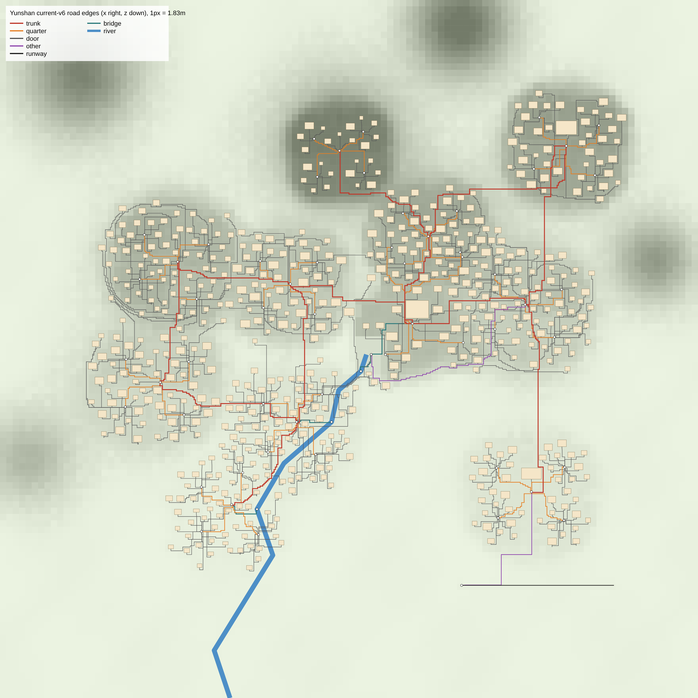
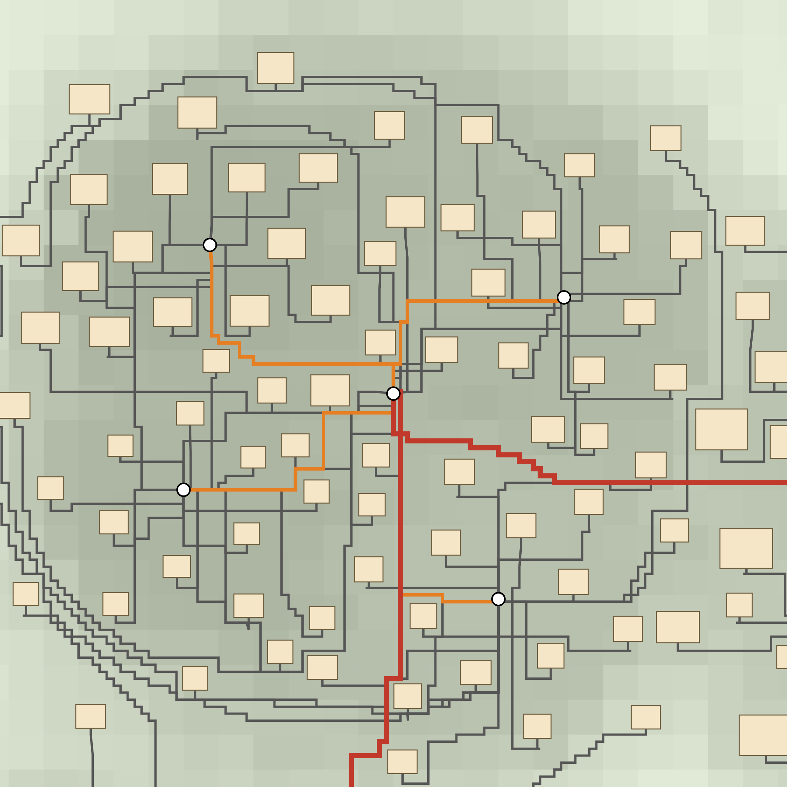
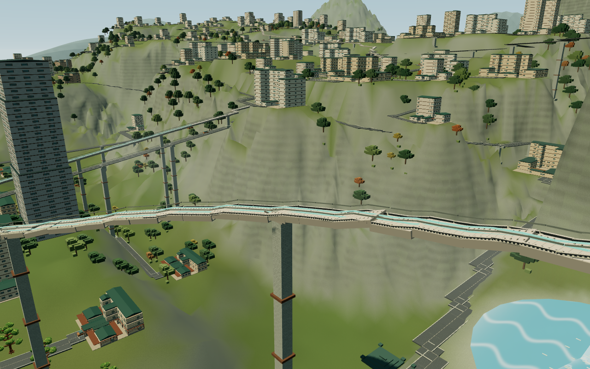
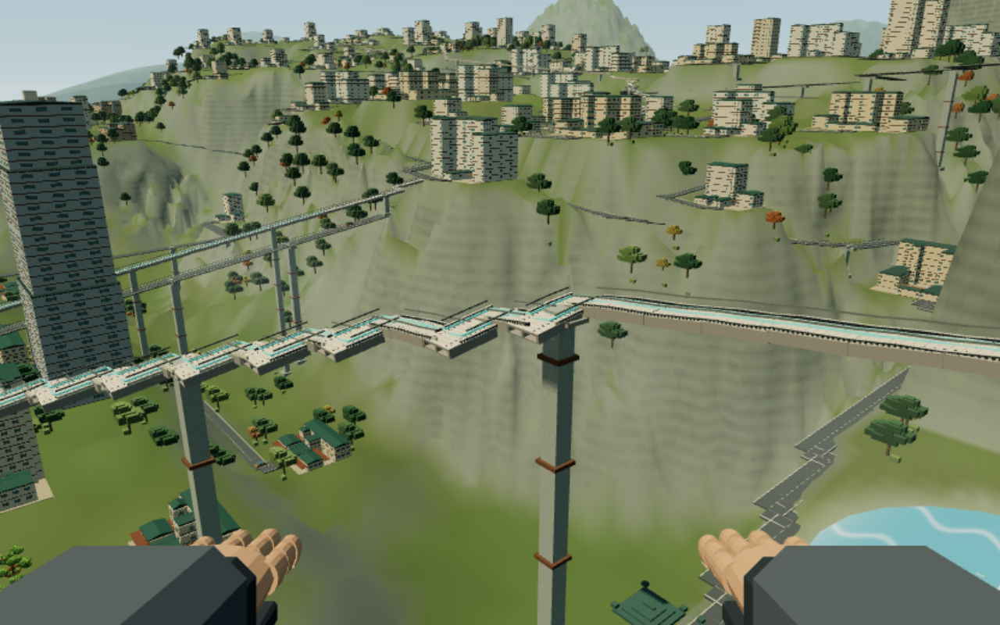
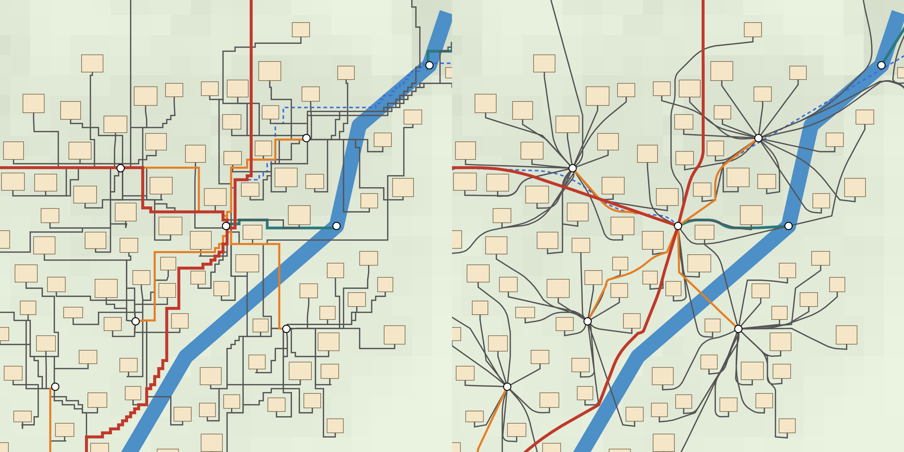
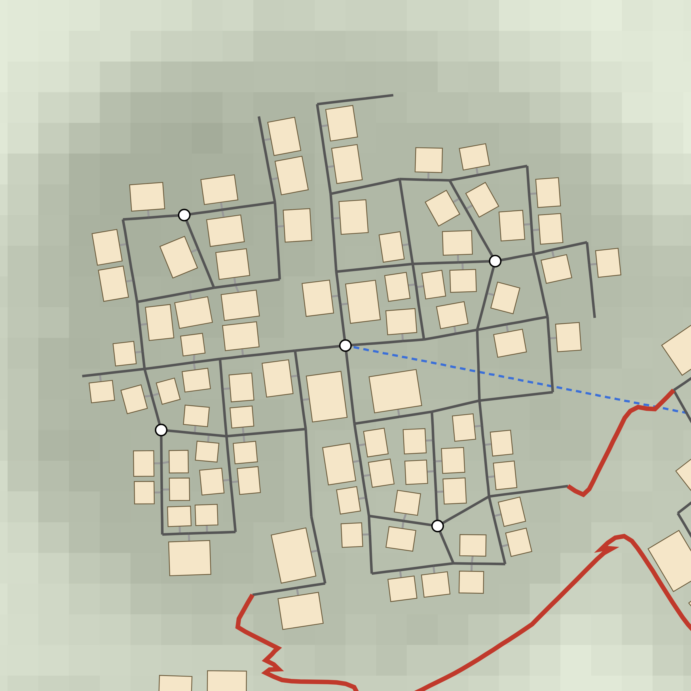

# 路网重做方案

> 状态：设计稿，等待用户确认，尚未实施。仓库 `/home/user/yunshan` 没有任何改动（分支 `claude/focused-tesla-ls4bw6`，HEAD `100130d`）。
> 下文的数字都是在 `createProductWorld()`（`current-v6`，种子 20261001）和三个原型上用脚本实测得到的。原型只是工作目录里的副本，没有跑 `npm test`、UI、浏览器测试，也没有跑 dotnet。
> 原型脚本与原始数据在 `design-work/roads/{generation,consumers,voxel,proto-any-angle,proto-contour-streets,proto-planned-fabric,adversary}/`。

---

## 1. 原因诊断

### 1.1 结论：不是体素连续性，是 4 邻接 A*，加上“一栋楼一条路”

用户的判断是“为了保证体素连续性，导致路网非常扭曲”。这个判断不成立。代码里没有任何体素规则要求道路沿 x/z 轴走。阶梯有两个来源：

| 原因 | 位置 | 说明 |
|---|---|---|
| ① 只有 4 个方向 | `src/world.ts:379` `[[1,0],[-1,0],[0,1],[0,-1]]`；C# `unity/Assets/Yunshan/Core/World.cs:453` | 8 m 网格（`world.ts:350` `GRID = 8`）。凡是不正南北、不正东西的路线，都只能画成 x、z 交替的台阶。 |
| ② 曼哈顿启发式，平局随意选 | `world.ts:399`；C# `World.cs:480` | 平地上所有台阶走法的 g+h 都一样，堆随意挑一条。再加上逐格的地形代价（`:381-394`）跟着正弦起伏走，结果是很多 8 m 的小碎步，而不是一个干净的 L 形。 |
| ③ 事后不做平滑 | `world.ts:402-416` | 只合并精确共线的点，按 24 m 用 `q()` 重采样，删掉相距不到 3 m 的点。没有视线捷径，也没有曲线拟合。 |
| ④ 拓扑：612 条私有入户路 | `world.ts:594-598` | 每栋楼单独找路连到最近的站点，彼此平行、重叠。这正是截图里“路面重叠、碎块、并行重复路”的来源。 |
| ⑤ 渲染：转角没有斜接 | `src/rendering/network-structures.ts:20-64`、`studio-prop-layout.ts:195-217`、Unity `CityGeometry.cs:47-90` | 每段一个刚性盒子或一片 2 m 瓦片，转角不接缝。90° 转角外侧会出现约 5 m 的楔形缺口，内侧互相叠压（见 `img/stair-road-corner.png`）。 |

`routeGround` 头上的注释写得很清楚：“Orthogonal obstacle routing keeps every connector outside all building walls.”（`world.ts:348`）。选正交，是因为障碍检测只查网格顶点，图的是省事，跟体素无关。

### 1.2 代码里“体素”实际指什么

- **坐标量化：** `UNIT = 0.2`、`q()`（`world.ts:14-15`），只是把坐标和高度吸附到 0.2 m 格点上。两个格点之间可以连任意角度的线。
- **渲染：** 盒子按段旋转（`Quaternion.setFromUnitVectors`）。工作室瓦片 BUILT-131/132/134 都有 `yaw = atan2(dx,dz)` 和 pitch。
- **地形与通行：** 地形切削、行走高度、`roadMovementAllowed`、封路，都按点到线段的垂直距离计算（`world.ts:91, 263-266`；`src/roads.ts:46-68, 182`）。
- **车辆：** 沿任意三维折线运动（`samplePolyline`）。
- **全仓库唯一的方向规则在建筑上，不在道路上：** `rotation: 0`、门朝 +z（`world.ts:551`、`tests/world.test.ts:64`、`commercial-district.ts:63`）。
- **反证：** 现网已经有 809 个非直角折点，跑道、索道、原型里的斜路也都走同一条管线，没有任何东西坏掉。

### 1.3 现状指标（current-v6，671 条道路边）

| 指标 | 值 |
|---|---|
| 总长 / 两端直线距离之和 | 172.1 km / 120.5 km，**绕行比 1.427**（中位数 1.42，正好是阶梯的上限 √2） |
| 直角转弯 | 3,983–4,021 个，**约 23.4 个/km**；单条边最多 72 个（`road-west-b60-door-west-quarter-3`，1,524 m，直线距离只有 725 m） |
| 沿轴向的长度占比 | 道路 **95.9%**，磁悬浮和轻轨 98.8%（铁路也调用 `routeGround`，`world.ts:620`） |
| 回头弯（>150°，12 m 内） | 171 个 |
| 入户支路 | 612 条，139.6 km，**占总路长 81%** |
| 重叠 | 4 m 栅格里 19.8% 的格子被 2 条以上的边共用，单格最多 22–25 条；去重后中心线只有约 127–130 km |
| 坡度 | 每条边全程只用一个线性坡度（`world.ts:417-423`）。最大段坡度 0.200（测试上限 0.25）。直线坡度 >12% 的边有 83 条；政府→山顶 26%（778 m 爬升 202 m），全靠绕路把坡度摊下来 |
| 没有共享节点的交叉 | 69 处，其中 3 处高差落在 0.26–3 m 之间（既不算平交，也不算立交） |
| 生成耗时 | 约 5–10 s（共享 4 核，单次测量） |

---

## 2. 目标（可量化）

目标对应用户已经确认的两阶段验收（`开发备忘录.md` DESIGN01）：①无人机视角对标文澜学苑概念图；②第一人称走在街上。下面的指标在新布局上用同一套脚本测量（脚本在 `design-work/roads/*/measure.mts`，实施时要转成仓库内的测试和审计脚本）。

| 类别 | 指标 | 现状 v6 | 目标（新布局） |
|---|---|---|---|
| 转弯密度 | 车行道直角转弯（±5°，路口本身不算） | 23.4/km | **≤ 0.5/km** |
| | 20 m 内航向变化 >60° | 16.3/km | ≤ 2/km（声明的回头弯段除外） |
| | 车行道最小转弯半径 | p1 = 3.1 m | ≥ 12 m（回头弯段 ≥ 8 m；封路扫掠要求 ≥ 6 m） |
| | 沿轴向长度占比 | 95.9% | ≤ 15% |
| 路径比 | 每条边：长度 ÷ 直线距离（按长度加权） | 1.427 | ≤ 1.15（回头弯段单独统计） |
| | 门 → 本区车站的网络路径比：均值 / 最大 | 2.42 / 16.8 | **≤ 1.6 / ≤ 4** |
| | 站间干道路径比 | 1.17–1.46 | 平缓段 ≤ 1.3；山地段 ≤ 坡度所需长度 × 1.15 |
| 重复与铺装 | 4 m 格被多条边共用的比例 | 19.8% | ≤ 8% |
| | 铺装面积（10 m 车道） | 100 ha | ≤ 75 ha |
| | 车站周围的放射状扇形铺装 | — | 不存在：站点处车行边 ≤ 6 条 |
| 坡度 | 车行道段坡度 | 最大 0.20 | 设计值 0.12，硬上限 **0.16**；测试保留 0.25 总上限 |
| | 车站和市场站坪 | 0.20 | 站坪 ≤ 0.02，进站段 ≤ 0.12 |
| | 步行梯街 | 不存在 | 0.16–0.60，只允许行人通过 |
| 交叉 | 没有共享节点的地面道路交叉 | 69 | **0**；交叉要么是路口节点，要么是声明的桥或立交边 |
| | 立交净空 | — | ≥ 4.8 m |
| | 路面埋在切削后地形下 >1.5 m，或悬空 >1.5 m 而没有桥体 | 35 / 35 | 0 / 0 |
| 不变量 | 0.2 m 格点、端点与节点逐位相同、建筑外扩 5 m 的扫掠净空、连通性 | 全部通过 | 全部通过，并扩展到所有边 |
| | 建筑放置 / 商业区步骤 | 612 栋 / 正常运行 | 612 栋全部放置 / `applyCommercialDistrict` 不抛错 |
| 性能 | TS 世界生成 | 5–10 s | ≤ 15 s，C# 同量级 |
| | 道路点数 | 10,466 | ≤ 14,000（`roads.ts` 扫掠、NPC 楼梯检测、`getWalkHeight` 的开销都和点数成正比） |
| 画面 | 与 `images/2.jpg` / 文澜学苑同机位并排对比 | 不合格 | 街道沿台地等高线弯曲；陡处是石阶梯街；切坡有挡土墙；车站不出现铺装扇面；转角无裂缝。由用户在并排图上判定 |
| | 第一人称 | 路缘横穿车道，有灰色碎块 | 路缘连续，路口有路口面，梯街可以走，脚下高度与路面一致 |

---

## 3. 推荐方案

### 3.1 评审结论与修订

三个原型的评审结果：

- **any-angle（只换路由器）：** 风险最低，彻底消除阶梯（直角转弯从 23.4 降到 1.7/km，回头弯从 171 降到 1，铁路也变成曲线）。但每个车站变成 10–25 条曲线辐条的“星芒”，重叠格只从 19.8% 降到 14.7%。
- **planned-fabric（规划街区网）：** 唯一看起来像城市的方案。共享街道图、短门桩、475 种建筑朝向、门→站路径比 1.51、共用格 6%。但硬指标大量失败：71 段坡度 >25%，15 栋楼没放下，商业区步骤抛错，一处过河没有桥，生成要 175–334 s。
- **contour-streets（等高线街）：** 不作为基础，只从中提取做法。

两位评审都建议先把 any-angle 作为 v8 产品布局上线，再用 v9 做街区网。**对抗审查判定这一路线不合格（fatal），我采纳这个判定：**

- 用户已经决定“以概念图为准做世界重建，不再零散修补”，并且综合方案要先交用户确认。
- 过渡版 v8 达不到验收①（星芒），但一旦成为产品布局，按存档指纹（`persistence/world-layout.ts` 的 `selectSavedWorld`），所有在 v8 上建的城市都要在 TS 和 C# 两侧永久逐字节复现。C# 至今还没移植 v7（`World.cs:520` 抛 `NotSupportedException`），说明这类负担确实会累积。

**修订后的推荐：只发布一个新产品布局 `current-v8`，内容是完整的新路网。** any-angle 路由器降级为内部模块（全网共用的平滑器）。开发期间用一个**不注册**的开发配方（`dev-streets`，不加入 `CITY_LAYOUT_VERSIONS`，不能存档）出图、跑指标、给用户看阶段截图。只有全部验收通过，才注册 `current-v8`，完成 C# 移植，并切换 `PRODUCT_CITY_LAYOUT`。`CURRENT_CITY_LAYOUT` 保持 `current-v6`，这样 27 个默认世界测试文件和所有 `*-v6` 夹具都不受影响。

### 3.2 方案组成（以 planned-fabric 为骨架，嫁接另外两个原型）

**A. 共享平滑器 `smoothRoute`（来自 any-angle，所有生成器共用）**
1. 8 邻接 A* 加八分距离（octile）启发式，不允许切角。只用作粗走廊；平局一律按固定的 (f, g, 插入序号) 打破，方便 C# 重放。
2. 拉绳（string-pulling）：捷径必须通过对建筑外扩 5 m 的**精确线段扫掠测试**，离河 ≥ 22 m，代价不超过被替换的那段原路径，并且长度不能低于 `|Δy|/坡度上限`（长度预算）。
3. Chaikin 切角 3–4 遍，每条新弦都要过建筑和河流检测，过不了的角保留不切。然后 Douglas–Peucker（0.2 m）、≤ 24 m 重采样、`q()` 吸附，点间距 ≥ 4 m。
4. **强制收尾：** 最后再做一遍全段精确扫掠修复，把被删掉、导致弦切进建筑的点放回去。这一遍对所有生成器的输出都执行，用来修掉原型里 26 处和 10 处的净空违规。
5. 铁路（磁悬浮、轻轨）、桥、连接线都走这个平滑器，并且在**放置建筑之前**生成，保证高架连续。

**B. 街区街道网（来自 planned-fabric，按“地形化”修正）**
1. 每个区从山体场的梯度取局部等高线方向作为街网主方向，但网格线**沿等高线弯曲**，不保持刚性直线：主街沿台地带走，横街顺坡或做成梯街。地块 60–130 m，角点加扰动。
2. 车站和季度站点放在街网节点上，不再作为辐射中心。站点处的车行边不超过 6 条。
3. 建筑沿街面放置，后退 10 m，**朝向街道旋转**，大小和种子的随机序列与 v5/v6 完全一致。门由旋转后的平面给出，门桩是一条垂直于街道的短线，**终点精确等于 `${site.id}-door` 节点**（满足货运取货的 `freight-access.ts:66-74`）。门前不再有 +z 方向的直角拐角。
4. 放不下的建筑要有回退：先就近换街面，再允许缩小后退距离，再允许并入相邻地块。**目标是 612/612 全部放下**，原型里落下的 15 栋大型诊所、礼堂、站房都要放进去。
5. 固定的市政用地保持 rotation 0，但它周围的街道要绕开。`commercial-district.ts` 增加旋转用地配方（取代 `:63` 的 `rotation === 0` 前提），或者把五座银行塔的用地固定为与所在街道平行的 0°/90° 地块。两种做法都要求 `applyCommercialDistrict` 不抛错。
6. 每个季度至少有 1 条环路或横街（来自 contour-streets 的教训：树状网会让门→站路径比恶化到 3.21），删掉没用的尽端路。

**C. 山地干道与梯街（来自 contour-streets 和 rendering D）**
1. 区间干道不再用“闸口到闸口的平滑 A*”。改为 16 方向、坡度加权的走廊搜索，设计坡度 12%，每次转向不超过 45°，再用平滑器 A 收尾。
2. **显式回头弯生成器：** 直线坡度超过 16% 的链路（政府→山顶 26%、工坊→西区 27%、东区/政府→星港），在走廊里按 ≥ 8 m 的半径、≥ 40 m 的直段铺之字弯，直到长度满足坡度预算。回头弯段打上标记，单独统计指标，也单独渲染挡土墙。
3. 新增一种真正的**步行梯街边**（例如 `mode: 'stair'` 或道路边上的 `pedestrianOnly` 标志）：坡度 0.16–0.60，只给行人走。`roadMovementAllowed`、车队生成、货运寻路和主路偏好都要排除它；NPC 楼梯运动和 `getWalkHeight` 要接入它。陡坡上的门桩、横街自动降级为梯街。
4. 过河一律用声明的桥边（清空高度 ≥ 4.8 m），连接线禁止直接越过河道和瀑布。修掉原型的 `join-market-junction-1_n2`。

**D. 平面化与交叉规则**
1. 两条地面路相交、高差 ≤ 3 m 时，在交点建共享路口节点，高差按两侧剖面混合抹平（planned-fabric 的做法：最大坡度从 2.34 降到 0.465，再配合 C2 降到上限以内）。
2. 高差 > 3 m 的交叉，只有当上层是声明的桥边、净空 ≥ 4.8 m 时才允许。否则重新取剖面，或者改走路口。**禁止出现“埋在山里的路”和“悬在空中的地面路”**：地面路的路面与切削后地形的高差要 ≤ 1.5 m，超出部分必须是桥边。

**E. 市场站坪（修掉 v7 的谱系缺口）**
v7 的 `applyMarketStationApron` 套在斜路上会抛错（`road-market-b22-door-market-station`），而且边界点没有经过 `q()`。v8 不叠加 v7，改为由生成器**原生产出站坪**：所有车站和市场站点的入口段在生成时就整平（≤ 0.02），进站段 ≤ 0.12，边界点经过 `q()`，进入站坪矩形只允许一次。这样 v7 修复的 17 条边的坡度问题，在 v8 中由构造保证。

**F. 模拟规则（按布局门控，旧存档不变）**
1. **信号灯：** 现在每个道路节点都有一盏灯（`simulation.ts:970`）。v8 只在度 ≥ 3 的路口和车站设灯，门桩接入点和度为 2 的节点不设灯。否则节点从 670 增加到约 1,550，出行时间会被灯拖长。
2. **车队：** 现在按“道路边 ≥ 80 m”配车（`simulation.ts:229`），路一缩短，车队就从 344 辆悄悄掉到 334 辆（配送车 212 → 202）。v8 改为显式规则：每个市场、工坊、农场、渔港站点按需求各配 1 辆配送车，挂在它的门桩上；站间车按干道路段配。目标是总车数和货运能力与 v6 偏差 ≤ 5%，由 `npm run audit:economy` 确认。
3. **路口节点的 `station` 标志：** 按主路偏好（`simulation.ts:1067`）有意识地设置，不是顺带产生的副作用。
4. 个体步速保持 4.2/3.1 m/min 不变。路变短带来的出行时间变化来自真实几何，在审计里如实报告，不另做补偿。

### 3.3 对抗审查问题逐条处理

| 审查问题 | 级别 | 处理 |
|---|---|---|
| 过渡版 v8 违背“世界重建、不零散修补”，还要背永久兼容负担 | fatal | §3.1：只注册一个最终 v8；路由器作为内部模块；阶段成果用不注册的开发配方展示 |
| 只换路由器后重叠、碎块、并行重复路仍在（重叠格只降 6.5%，单格 25 层） | major | 方案 B 用共享街道图和门桩取代 612 条私有支路；目标是共用格 ≤ 8%、铺装 ≤ 75 ha、站点车行边 ≤ 6 |
| 交叉闸门太窄：不经节点的立交从 66 增到 213，路面被埋 116 处、悬空 145 处 | major | 方案 D：地面路之间的交叉要么建路口节点，要么是声明的桥边（≥ 4.8 m）；路面与地形的偏差 ≤ 1.5 m；目标 0/0 |
| `rendering.test.ts:82-100` 实际只检查河桥，挡不住 20 处坏交叉 | major | 新增 `tests/world-v8-streets.test.ts`，对所有道路和桥边两两检测交叉、净空和埋深（§5.4）；不再依赖 rendering.test |
| v7 站坪不能叠加，而且会丢失 17 条边的修复 | major | 方案 E：生成器原生产出站坪，`q()` 边界点，并加专门测试 |
| 车队与经济“不受影响”的说法不成立（344 → 334） | major | 方案 F2：显式车队规则，偏差 ≤ 5%，审计必跑 |
| 门口 +z 直角拐角没动 | major | 方案 B3：建筑朝街旋转，门桩垂直于街道 |
| 车辆朝向按段索引计算，在曲线上会转错 | major | §4.5 和阶段 P4：TS `renderer` 与 Unity `CityLifeView.cs:148-153` 都改为 `pointOn(p±ε)`，并做奇偶校验，列入工期 |
| planned-fabric：坡度 71 段、15 栋没放下、商业区抛错、过河、175–334 s | 评审指出 | C2 回头弯和 C3 梯街；B4 放置回退；B5 商业区旋转配方；C4；性能：先用 32 m 粗走廊再细化，带朝向的状态搜索只在走廊内做，预算 ≤ 15 s |
| contour-streets：山顶跳高 55 m、26 处净空违规、门路径比变差 | 评审指出 | C2、A4 强制修复、B6 环路 |

---

## 4. 体素连续性的渲染做法

原则：**权威数据仍然是 0.2 m 格点上的折线；“体素感”交给渲染和地形外壳来体现。** 斜路和曲线路照样连续，不需要退回正交。

1. **地形外壳已经是体素化的。** `src/rendering/terrain.ts` 的 `shell()` 在近处用 1 m（高画质）或 2 m（均衡画质）的柱子，顶面吸附到 0.2 m。斜路两侧会自然形成 1 m / 0.2 m 的台阶式边坡（`img/proto-road-diag-top.png`），这一点不用改。
2. **路面改成连续带状网格（方案 A，主方案）。** 每条边生成一条带子，在每个顶点沿角平分线切开（斜接），路面、0.5 m 板侧、两侧路缘（±4.75 m）、中线一起扫掠。UV 按弧长重复，纹理取 BUILT-131/132/134/142 做成可平铺的 2 m 图集。路缘截面保留 0.2 m 的体素倒角，所以近看仍是体素块面。按原型实测，4 m 段长、10 m 路宽时，刚性瓦片在曲线上的缝约是 半宽 × 转角：半径 30 m 时约 0.67 m，半径 100 m 时约 0.2 m。带状网格把这个缝降为 0。
   - TS：`network-structures.ts`、`studio-prop-layout.ts` 的道路瓦片（BUILT-131/132/134）。
   - Unity：`CityGeometry.NetworkMesh`，以及 C# `NetworkStructures.cs`、`StudioPropLayout.cs`，都按同一规则实现，并做奇偶校验。
   - 绘制调用从约 8.5 万片瓦片降到每条边一条带子（按 LOD 分块）。
3. **路口面。** 度 ≥ 3 的节点生成一个多边形路口面，路缘在路口开口处断开。这样就不会再出现“路缘横穿车道、灰色碎块”（`img/stair-road-corner.png`）。
4. **挡土墙与切坡（方案 E）。** 切坡或填方高差 > 1.2 m 时，沿偏移后的折线每 8 m 放一段 ENV-082 石挡墙，配 ENV-084 墙帽、ENV-088 路肩、ENV-085 矮石台地墙。半径 ≥ 60 m 的曲线只需要短角件；回头弯段用 BUILT-313 作为参考拆件，不整体放置（用户 2026-10-09 已经决定不放整组合）。这一层正是概念图里“台地悬崖”的感觉。
5. **梯街（方案 D）。** 梯街边用 BUILT-217 的直跑梯段（10 级，4 m 内升 2 m，宽 3.2 m）加平台串起来，平面上只在平台处转向。栏杆用 BUILT-242，侧墙用 BUILT-216 和 ENV-082。这些资产目前都是 `unassigned`，要接入 `getWalkHeight` 和移动控制器：脚下高度按梯级取 0.2 m 台阶，与渲染一致。
6. **不采用方案 C（把车行路面做成体素柱）。** 坡面上会变成 0.2 m 的台阶（5% 坡时踏步 4 m 一级），车辆看起来会颠，远处也覆盖不到。Unity 的地形是平滑的 8 m 网格，没有可以打印的外壳。只在梯街和人行铺地的近处细节上，借用 0.2 m 柱的表现。
7. **附带修正：** 车辆朝向改为 `pointOn(p±ε)`；磁悬浮和轻轨的青色线沿段法线偏移（现在是沿世界 x 方向 ±1.8，`network-structures.ts:42`、`NetworkStructures.cs:50`）；墩帽和支撑盒按段的 yaw 旋转。

---

## 5. 影响面与兼容

### 5.1 布局版本与存档
- **注册：** 在 `CITY_LAYOUT_VERSIONS` 末尾追加 `'current-v8'`（`src/world.ts:8`；`selectSavedWorld` 按顺序尝试，所以必须追加在最后）。`CURRENT_CITY_LAYOUT` 保持 `current-v6`。只把 `PRODUCT_CITY_LAYOUT` 改为 v8（`src/product-city.ts:15`）。
- **v8 不能写成 v6 的后处理。** 道路是在 v5 配方内部生成的，铁路和地形都依赖道路，所以要给共享生成器传一个内部道路配方标志，然后接 `applyCommercialDistrict`。v8 不叠加 v7（见方案 E）。
- **所有显式布局列表都要加 v8**，否则会静默回退到旧行为：`world.ts:55`（70 m 边距）、`:209`（地质起伏）；`persistence/world-layout.ts:24, 34, 35, 43`，并在 `:48` 旁新增 `streets` 算法描述（例如 `{algorithm:'street-fabric-v1', grade:0.16, stair:true}`）；C# `World.cs:13, 89, 247, 517-527`。
- **旧存档：** 指纹会对所有边的 `points` 和 `length` 做哈希，所以 v2–v7 的存档继续绑定各自的配方，不受影响。存档里保存的封路、施工许可、车辆用的是边 id，这些 id 在各自的版本内有效。

### 5.2 C# 移植
- 在配方冻结之后**一次性**移植：平滑器、街网、回头弯、平面化、旋转放置（含 `getBuildingEntrance` 的旋转路径）、原生站坪、梯街边。
- TS 代码从第一天就按奇偶友好的方式写：只用 JsMath 已移植的函数（sin/cos/exp/atan/atan2/hypot/round，以及 IEEE 安全的 sqrt/floor）；禁用 tan/acos/pow/log；排序用 V8Sort，遍历用 JsCollections 的顺序；堆的平局规则固定。
- 新增 `world-current-v8.json.gz`，在 `WorldParityTests.cs:24-26` 加 `[InlineData("current-v8")]`。生成命令：`npx tsx scripts/parity/world.ts dotnet/Yunshan.Core.Tests/Parity/world-current-v8.json.gz current-v8`。
- 新增一个 C# 产品布局常量，让 `CityBootstrap.cs:74-80` 不再先生成 v6 再重生成 v8。更新 `SimHostClientTests.cs:36` 的固定值。

### 5.3 消费方

| 消费方 | 需要做的事 |
|---|---|
| 行走 / `nodePath` / `nodeAt` / `walkingAnchors` | 保证端点与节点逐位相同；内部点不能与其他节点重合 |
| NPC 楼梯运动、参考碰撞 | 全段扫掠净空（A4）；梯街接入楼梯运动 |
| 车辆、信号、车队、货运 | 按 F1–F3 改规则（按布局门控）；朝向改为 `pointOn±ε` |
| 货运取货 | 门桩终点 = 门节点，车道偏移 1.3 m < `LOADING_REACH` 2 m；补 v8 的取货夹具 |
| `roads.ts` 封路与施工 | 车行道最小半径 ≥ 6 m（目标 12 m），保证 `along` 单调；梯街不参与车辆封路扫掠 |
| 护栏与交叉（`transport-geometry.ts`） | 平面化之后，交叉都在路口节点上；桥边净空 ≥ 4.8 m |
| 地形切削、`getWalkHeight`、林地与地表装饰 | 算法不用改；v8 的树木和装饰布局会变，需要新增 v8 夹具 |
| 渲染（TS 与 Unity） | 带状网格、路口面、挡墙、梯段、铁路线偏移、墩帽 yaw |
| 建筑旋转 | 楼体、立面构件、Unity 楼体网格、楼层平面体、楼梯平台、`getBuildingEntrance`、`commercial-district.ts:63` |
| 小地图、封路覆盖层 | 不用改 |

### 5.4 测试
- **新增 `tests/world-v8-streets.test.ts`**，在种子 20261001、7、2024 上检查：
  - 0.2 m 格点；端点逐位相同；长度等于弧长
  - 每段坡度：车行道 ≤ 0.16，梯街 ≤ 0.60，全部 ≤ 0.25 的车行上限
  - 对建筑外扩 5 m 的全段扫掠
  - **所有道路和桥边两两交叉**：0.26–3 m 的高差为 0；没有节点的地面交叉为 0；立交净空 ≥ 4.8 m；埋深和悬空 ≤ 1.5 m
  - 612 栋楼全部放置；商业区成功应用
  - 连通，每扇门都能到本区车站；门→站路径比的均值和最大值
  - 转弯密度、沿轴向占比、共用格比例、铺装面积
  - 站坪的坡度和只进入一次
  - 梯街不允许车辆、不进车队、不进货运
- 把 `tests/world.test.ts:64` 的 rotation 0 断言改为按布局判断：v6 及以前仍然断言 0；v8 断言门朝向街道、门在旋转后的南墙中点。
- 更新产品布局固定值：`tests/city-ruleset.test.ts:178-185`、`tests/world-layout.test.ts:22-25`。
- 重建 `scripts/world-snapshots-gen.ts`、sim-host 包和 `worlds.json.gz`（`scripts/build-sim-host.mjs`）。
- 可选：给 studio、network、walker、woodland、ground/river dressing、station 的奇偶脚本加布局参数，生成 `*-v8` 夹具。
- 必跑：`npm run build`、`npm test`、`npm run audit:economy`、`npm run test:ui`、`npm run test:browser`、`npm run benchmark`（单独跑，注明加速档和 CPU 测量范围）、dotnet 测试。软件渲染（SwiftShader）的截图只能作为画面证据，不能作为 macOS 硬件性能证据。

---

## 6. 分阶段实施

整个过程只发布一个产品布局。P1–P5 都在不注册的 `dev-streets` 配方上进行，不能存档，只用于出图、跑指标、测试。

| 阶段 | 内容 | 验收 | 估时 |
|---|---|---|---|
| **P0 确认** | 用户确认本方案和 `streets` 描述；合并进世界重建总方案 | 用户书面确认；备忘录记录 | — |
| **P1 平滑器与检测框架** | 把 `smoothRoute`（A1–A5）做成独立模块；在仓库内新建度量脚本（转弯、路径比、共用格、交叉、埋深）和 `world-v8-streets` 测试骨架；铁路、桥、干道先接上平滑器 | 开发配方上：直角转弯 ≤ 2/km；铁路沿轴向占比 ≤ 20%；扫掠净空 0 违规；格点和端点全部通过；生成 ≤ 10 s；v6 指纹仍为 `b85fa6ec`（证明没碰旧版本） | 1 周 |
| **P2 街区街网与旋转建筑** | B1–B6、方案 E 站坪、D 平面化 | 612/612 栋放置；商业区成功应用；共用格 ≤ 8%；门→站路径比均值 ≤ 1.6、最大值 ≤ 4；没有节点的地面交叉为 0；站点车行边 ≤ 6；无人机视角截图给用户初看 | 2–2.5 周 |
| **P3 山地干道、回头弯、梯街** | C1–C4；梯街边模式接入行走、楼梯运动、`getWalkHeight`，并在封路、车队、货运中排除 | 车行道坡度 ≤ 0.16；全部 ≤ 0.25；梯街 ≤ 0.60 且没有车辆；过河全部是桥；埋深和悬空为 0/0；生成 ≤ 15 s | 1.5–2 周 |
| **P4 渲染** | 带状路面和路缘、路口面、挡墙（E）、梯段（D）、铁路线偏移、墩帽 yaw、车辆朝向 `pointOn±ε`（TS） | 同机位并排图：转角无裂缝，路缘不穿车道；第一人称走一条梯街和一个路口；`test:ui`、`test:browser` 通过 | 1.5–2 周 |
| **P5 模拟门控与经济** | F1–F4：v8 的信号灯、车队、station 标志 | `audit:economy` 通过，车队和货运能力偏差 ≤ 5%，资金守恒残差保持在 1e-9 量级；出行时间变化单独报告；`benchmark` 单独运行并记录 | 1 周 |
| **P6 冻结、注册、移植** | 注册 `current-v8`、补全布局列表和 `streets` 描述；C# 全量移植，包括 Unity `NetworkMesh` 和 `CityLifeView` 朝向；生成奇偶夹具；更新快照和 sim-host；切换 `PRODUCT_CITY_LAYOUT`；更新备忘录 | dotnet 的 `world-current-v8` 逐字节一致；v6 及以前的所有夹具不变；Unity 能直接打开 v8 城市；用户完成验收①并签字 | 2–3 周 |

合计约 **9–12 周**，一名开发者。P4 可以和 P3 部分并行。

---

## 7. 风险

1. **坡度与地形不可行。** 有 5 对链路的直线坡度超过 16%（最陡 27%）。回头弯会让干道变长，并占用台地空间。缓解：在 P3 之前先对每条链路算可行性；不可行的链路由索道或升降机承担主通达，道路只做次要通道。
2. **生成性能。** planned-fabric 的带朝向 A* 曾经达到 150 万个状态、175–334 s。缓解：粗走廊再细化，在 P1 就设好 15 s 的预算闸门，超时就阻止合入。
3. **C# 逐字节奇偶。** 生成器复杂度会是现在的数倍。缓解：从第一天按奇偶规则写；冻结之后再移植；按生成步骤分段导出中间夹具，二分定位差异。
4. **建筑旋转的连锁影响。** 楼体、立面、楼梯平台、商业区、Unity 网格都默认 rotation 0。缓解：P2 先把消费方清单逐项测完；商业区五塔可以退回到与街道平行的 0°/90° 地块。
5. **经济回归。** 路口、信号灯、车队、出行时长都会变。缓解：F 节的规则按布局门控；审计偏差闸门 ≤ 5%；旧存档行为不变。
6. **画面仍达不到概念图。** 刚性网格看起来像“倾斜的棋盘”，各区之间是孤岛。缓解：B1 让网格沿等高线弯曲、区间连续铺开；P2、P4 各给用户一次同机位截图，及早纠偏。
7. **梯街资产没有接入。** BUILT-217/242 等目前是 `unassigned`，不在 `public/studio-assets` 里。缓解：P3 先用程序生成的 0.2 m 台阶占位，P4 再替换成资产。
8. **点数和开销。** 曲线会增加点数，`roads.ts` 的扫掠、NPC 楼梯检测、`getWalkHeight` 的开销都会上升。缓解：点数上限 14,000，P5 的 benchmark 单独记录。
9. **测量本身的局限。** 本文数字来自原型的单次运行（共享 4 核），仓库测试和 dotnet 都没有跑，进入实施后要用仓库内的脚本重新测量。

---

### 附图
- 现状：`img/01-current-roads.png`、`img/02-current-west-zoom.png`、`img/stair-road-corner.png`、`img/maglev-stair.png`
- 任意角路由器（星芒问题）：`img/03-anyangle-compare-market.png`、`img/04-anyangle-compare-west.png`

- 规划街区网（推荐骨架，干道仍不合格）：`img/05-fabric-proposed.png`、`img/06-fabric-west-zoom.png`

- 等高线街（只提取做法）：`img/07-contour-proposed.png`
- 斜路、曲线与体素外壳：`img/proto-road-diag-top.png`、`img/proto-maglev-smooth.png`
